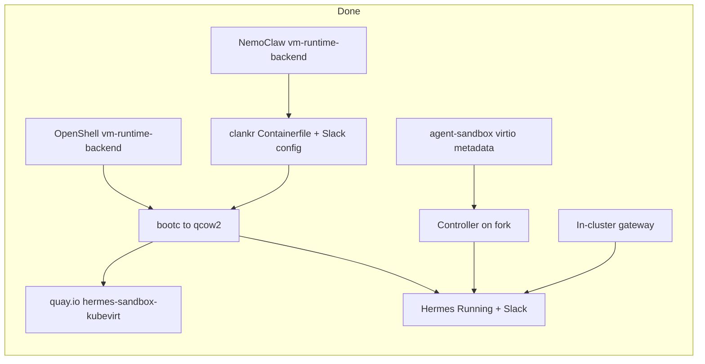

# KubeVirt VM Hermes: Handoff + Bake Results

> **Read this first if you have no context.** This is the living handoff for running Hermes (NemoClaw) as a KubeVirt VM on CRC via OpenShell’s k8s driver + agent-sandbox `runtimeBackend: VirtualMachine`. **Home of this doc:** [`shanemcd/openshell-kubevirt`](https://github.com/shanemcd/openshell-kubevirt). Last updated **2026-07-12 (evening ET)**.

## Current state (2026-07-12 late night) — start here

### Goal of the latest work

1. **Deliver guest metadata without cloud-init** — controller attaches a KubeVirt Secret virtio disk (`serial=sandboxmeta`); Hermes bootc mounts it and owns systemd/TLS layout/supervisor start.
2. **Mirror the pod TLS contract on the VM path** — driver mounts `client_tls_secret_name` + path env vars; controller attaches Secret `volumeMount`s as extra Secret virtio disks (listed in `volumes.json`). Never pass TLS PEM via `openshell sandbox create --env`.
3. **Optional KubeVirt RBAC** — Pod-only installs must not get `kubevirt.io` in the default ClusterRole.
4. **Publish the Hermes containerDisk** to Quay for reuse outside CRC.

### Branches (compare vs upstream `main`)

| Upstream | Fork branch | Compare |
|----------|-------------|---------|
| [`kubernetes-sigs/agent-sandbox`](https://github.com/kubernetes-sigs/agent-sandbox) | [`shanemcd/agent-sandbox` `kubevirt-backend`](https://github.com/shanemcd/agent-sandbox/tree/kubevirt-backend) | [compare](https://github.com/kubernetes-sigs/agent-sandbox/compare/main...shanemcd:agent-sandbox:kubevirt-backend) |
| [`NVIDIA/OpenShell`](https://github.com/NVIDIA/OpenShell) | [`shanemcd/OpenShell` `vm-runtime-backend`](https://github.com/shanemcd/OpenShell/tree/vm-runtime-backend) | [compare](https://github.com/NVIDIA/OpenShell/compare/main...shanemcd:OpenShell:vm-runtime-backend) |
| [`NVIDIA/NemoClaw`](https://github.com/NVIDIA/NemoClaw) | [`shanemcd/NemoClaw` `vm-runtime-backend`](https://github.com/shanemcd/NemoClaw/tree/vm-runtime-backend) | [compare](https://github.com/NVIDIA/NemoClaw/compare/main...shanemcd:NemoClaw:vm-runtime-backend) |
| — | [`shanemcd/clankr` `main`](https://github.com/shanemcd/clankr) (Hermes bootc image/config; no fork/upstream split) | [repo](https://github.com/shanemcd/clankr) |
| — | [`shanemcd/openshell-kubevirt`](https://github.com/shanemcd/openshell-kubevirt) (this handoff / tracking) | [repo](https://github.com/shanemcd/openshell-kubevirt) |

Local clones (paths are machine-local; remotes matter more than layout):

| Clone | Branch | Remotes |
|-------|--------|---------|
| `kubernetes-sigs/agent-sandbox` | `kubevirt-backend` → `fork/kubevirt-backend` | `origin`=sigs, `fork`=shanemcd |
| `NVIDIA/OpenShell` (local checkout often under a personal org path) | `vm-runtime-backend` → `fork/vm-runtime-backend` | `origin`=NVIDIA, `fork`=shanemcd |
| `shanemcd/NemoClaw` | `vm-runtime-backend` → `fork/vm-runtime-backend` | `upstream`=NVIDIA, `fork`=shanemcd |
| `shanemcd/clankr` | `main` → `origin/main` | `origin`=shanemcd/clankr |
| `shanemcd/openshell-kubevirt` | `main` | this tracking repo (handoff doc) |

**OpenShell note (2026-07-12):** Active fork work is thin branch [`vm-runtime-backend`](https://github.com/shanemcd/OpenShell/tree/vm-runtime-backend) (VM Sandbox spec + SA/TLS/workspace/command). Old fat branch [`kubevirt-sidecar`](https://github.com/shanemcd/OpenShell/tree/kubevirt-sidecar) is **archived** (pod sidecar topology + unrelated rebases; not needed for Hermes VM).

**agent-sandbox tip (fork):** `e324bbf` optional KubeVirt RBAC; `99bd732` virtio Secret metadata (no cloud-init).

### Guest metadata contract (agent-sandbox → bootc)

**No `#cloud-config` / NoCloud userdata.** Controller creates Secret `<sandboxName>-meta` and attaches it as a KubeVirt Secret volume + virtio disk:

| Artifact | Contents |
|----------|----------|
| Disk serial `sandboxmeta` | Secret keys `env`, `volumes.json` (guest stages under `/run/sandbox-disks` then copies to `/etc/sandbox/` — do **not** leave `/etc/sandbox` as an iso9660 mount; SELinux blocks writes) |
| `/etc/sandbox/env` (after prepare) | Container env as `KEY=VALUE` (incl. `OPENSHELL_*` identity/endpoint/token/TLS **paths**) |
| `/etc/sandbox/volumes.json` | PVC entries `{name,serial,mountPath,source:persistentVolumeClaim,claimName}` + Secret disks `{…,source:secret,secretName}`. **Metadata disk itself is not listed.** |
| Secret `volumeMount`s (first container) | Extra Secret virtio disks (serial = sanitized volume name); guest mounts via `/dev/disk/by-id/virtio-*` and copies TLS → `/etc/openshell-tls/client` |

Bootc image ([`hermes/Containerfile.kubevirt`](./hermes/Containerfile.kubevirt)) owns: `sandbox-volumes.service` (after `local-fs`, **not** `cloud-final`), `openshell-sandbox.service`, `prepare-sandbox-volumes.sh`, `openshell-sandbox-prep-env.sh`, qemu-guest-agent, Hermes seals, supervisor binary. Cloud-init is masked in the image.

### What works on CRC right now

| Thing | Status |
|-------|--------|
| CRC OpenShift | Up; `oc` as `kubeadmin` via `~/.crc/machines/crc/kubeconfig` |
| Gateway `openshell-0` | **Ready 1/1** (Fedora 44 image; pin STS to **digest**, not tag alone) |
| Gateway config | `sandbox_namespace = "default"`, `runtime_backend = "VirtualMachine"`, `sandbox_command = "/usr/local/bin/nemoclaw-start-vm"`, `workspace_persistence = true`, `client_tls_secret_name = "openshell-client-tls"` |
| Route (prefer this) | `openshell-openshell.apps-crc.testing` → svc `openshell:grpc` (**TLS passthrough**). CLI gateway `crc` already points here with mTLS. **Do not use `oc port-forward` for normal work.** |
| agent-sandbox controller | Virtio Secret metadata + optional kubevirt RBAC on fork. **Pin deploy image to digest** (`istag …:kubevirt`). After redeploy with the RBAC split, apply `k8s/kubevirt*.yaml` or `--kubevirt` / `KUBEVIRT=true`. |
| OpenShell k8s driver (in gateway) | VM path emits TLS Secret volume/mount + `OPENSHELL_TLS_{CA,CERT,KEY}` path env (same as pods); workspace VCT when persistence enabled |
| Hermes Sandbox / VMI | `default/hermes` Ready / Running; Slack Socket Mode recovered after guest volume prep fixes |
| Guest metadata | Virtio `sandboxmeta` + Secret disks; `/etc/sandbox/{env,volumes.json}` + `/etc/openshell-tls/client/{ca.crt,tls.crt,tls.key}` |
| Guest units | `sandbox-volumes` + `openshell-sandbox` **active**; supervisor polls `GetSandboxConfig`; Hermes gateway + Slack up |
| `openshell sandbox exec` | **Working** — e.g. `openshell sandbox exec whoami` → `sandbox` (relay/session path OK) |
| PVC `workspace-hermes` | Bound; virtio serial `workspace` |
| ContainerDisk | CRC IS `openshell-sandboxes/hermes-sandbox-kubevirt:latest` **and** Quay `quay.io/shanemcd/hermes-sandbox-kubevirt:latest` (`@sha256:59d8793f9d3641291028ce0a6a5e4b77ae1b552a0aeead5badd246a926f04f7c`, also tagged `20260711`) |
| Host CLI | **`export OPENSHELL_GATEWAY=crc`** only — never local `tot` quadlets, never `OPENSHELL_GATEWAY_ENDPOINT` override for CRC |

### TLS notes (do not re-litigate)

- CLI **rejects** `--env` keys starting with `OPENSHELL_` (reserved). Passing `OPENSHELL_TLS_*_B64` / PEM on create is wrong.
- Pods never got PEM via `--env` either: driver mounts the Secret and sets **path** env vars. VMs now do the same; agent-sandbox attaches the Secret as a virtio disk and the guest copies keys into place.
- Helm certgen creates `openshell-client-tls` in the **release** namespace (`openshell`). CRC has `sandbox_namespace = "default"`, so the Secret must also exist in `default` (same rule as imagePullSecrets). Prefer aligning `sandbox_namespace` to the release ns long-term; mirroring the Secret into `default` is a CRC workaround, not a create-time step.
- Guest prep still accepts legacy `SANDBOX_TLS_*_{PEM,B64}` as emergency inject only.

### Access quirks

| Method | Status |
|--------|--------|
| `openshell …` via gateway `crc` (Route) | Preferred |
| `oc port-forward … 18080:8080` | **Avoid** — leftover debug habit; Route already exists |
| Console login | `sandbox` / `sandbox` |
| Day-2 **root** SSH | KubeVirt `accessCredentials` via guest agent (not in create path): `virtctl credentials add-ssh-key --create-secret --user root --file ~/.ssh/id_rsa.pub --force hermes -n default` then `virtctl restart` (first attach only); then `virtctl ssh root@vmi/hermes -n default`. Clear stale host keys: `ssh-keygen -R 'vmi.hermes.default'`. OpenShell `connect`/`exec` stay non-root by design. |
| `openshell sandbox exec` | **Working** (`whoami` → `sandbox`); was previously flaky/empty while `GetSandboxConfig` already worked |

### Next action (highest priority)

1. Redeploy controller from tip of `kubevirt-backend` and **bind optional KubeVirt RBAC** (`kubectl apply -f k8s/kubevirt-rbac.generated.yaml -f k8s/kubevirt.yaml` or `./dev/tools/deploy-to-kube --kubevirt`).
2. Optionally point Sandbox / create flow at `quay.io/shanemcd/hermes-sandbox-kubevirt:latest` (CRC still works from the internal IS).
3. Optionally set `sandbox_namespace = "openshell"` (or sync client TLS Secret into `default` from deploy).
4. Prove workspace PVC end-to-end on a clean recreate (no manual CR patches) — see Still open.
5. Commit remaining clankr guest image/doc changes; open upstream PRs when ready.

### Redeploy gotchas (do not repeat)

**Controller / gateway images are digest-pinned.** `podman push …:tag` + `rollout restart` can leave the pod on the **old digest**. Always:

```bash
# Controller
NEW=$(oc get istag agent-sandbox-controller:kubevirt -n agent-sandbox-system -o jsonpath='{.image.dockerImageReference}')
oc -n agent-sandbox-system set image deploy/agent-sandbox-controller "*=$NEW"

# Gateway
NEW=$(oc get istag openshell-gateway:dev -n openshell -o jsonpath='{.image.dockerImageReference}')
oc -n openshell patch sts openshell --type=json -p="[{\"op\":\"replace\",\"path\":\"/spec/template/spec/containers/0/image\",\"value\":\"$NEW\"}]"
```

**KubeVirt RBAC (after `e324bbf`):** core ClusterRole has **no** `kubevirt.io`. VirtualMachine sandboxes need:

```bash
# From agent-sandbox checkout
kubectl apply -f k8s/kubevirt-rbac.generated.yaml -f k8s/kubevirt.yaml
# or: KUBEVIRT=true make deploy-kind / helm --set controller.kubevirt=true / release asset kubevirt.yaml
```

**Gateway binary build (Fedora 44 toolbox):** `--features bundled-z3`, package with `FROM registry.fedoraproject.org/fedora:44` (not distroless) unless using `cargo-zigbuild`. Never put unknown TOML keys in the ConfigMap before the binary that understands them is running.

**Bootc → disk:** `build-hermes-bootc.sh` → push `hermes-sandbox-bootc` → in-cluster `bootc-builder` + `disk-packager` → CRC `hermes-sandbox-kubevirt:latest`. Mirror to Quay:

```bash
REG=default-route-openshift-image-registry.apps-crc.testing
podman pull --tls-verify=false "$REG/openshell-sandboxes/hermes-sandbox-kubevirt:latest"
podman tag "$REG/openshell-sandboxes/hermes-sandbox-kubevirt:latest" quay.io/shanemcd/hermes-sandbox-kubevirt:latest
podman push quay.io/shanemcd/hermes-sandbox-kubevirt:latest
```

---

## Summary (history)

KubeVirt VM support for the agent-sandbox controller so Hermes (NemoClaw) runs in a VM instead of a Pod. Full gateway integration works.

**As of 2026-07-10 (evening) — BAKE COMPLETE:** Initial two-service sidecar topology verified (Slack Socket Mode + Vertex inference). Primary contact channel is **Slack**. Discord disabled in image. Signal deferred (SSRF).

**As of 2026-07-10 (process mode) — SINGLE SUPERVISOR:** Hermes under `openshell-sandbox` (`--mode=network,process`). No `sandbox-workload` unit.

**As of 2026-07-12 (defer privilege drop):** Guest sets `OPENSHELL_DEFER_PRIVILEGE_DROP=1`. OpenShell chowns `/sandbox`, then spawns `nemoclaw-start-vm` as root under Landlock/seccomp; NemoClaw seals and setpriv-drops (container ENTRYPOINT order).

**As of 2026-07-12 (guest default command):** `openshell-sandbox-prep-env.sh` defaults `OPENSHELL_SANDBOX_COMMAND=/usr/local/bin/nemoclaw-start-vm` when metadata omits it. Gateway `sandbox_command` / create `--env` still override. Prefer empty gateway `sandbox_command` so the image owns the entrypoint.

**As of 2026-07-10 (late) — BRANCHES ON FORKS:** Controller + OpenShell sidecar work pushed to `shanemcd` forks (no upstream PRs yet). Early standalone `openshell-driver-kubevirt` POC dropped from the OpenShell branch; approach is an option on the existing Kubernetes driver + process+network sidecar runtime.

**As of 2026-07-10 (cleanup) — LEAN IMAGE + NEMOCLAW BRANCH:** In-image sed/python patches removed. VM/sibling-supervisor support lives on [`shanemcd/NemoClaw` `vm-runtime-backend`](https://github.com/shanemcd/NemoClaw/tree/vm-runtime-backend) (`NEMOCLAW_VM_SIDECAR=1` / `nemoclaw-start-vm`). Bootc image is Hermes + ddgs only (no rust, build toolchain, or extra CLIs).

**As of 2026-07-10 (late) — HERMES ≥0.18 INFERENCE FIX:** `provider: anthropic` + `base_url: https://inference.local` is ignored by Hermes (`_anthropic_base_url_override_ok`); it falls back to `api.anthropic.com` (DENIED by OpenShell). Live config must use `provider: custom`, `base_url: https://inference.local`, `api_key: sk-OPENSHELL-PROXY-REWRITE`, `api_mode: anthropic_messages`. Hot-fixing config/`.env` requires regenerating hashes in **sha256sum format** via `update-config-hashes.py` (wrong format crash-loops with `Config integrity check FAILED`).

**As of 2026-07-10 (night) — CLI WAS HITTING LOCAL KUBEVIRT STACK:** `openshell sandbox create` failures (`Pending: VMI phase: Pending` → immediate Error) were **not** the agent-sandbox controller. Host CLI was talking to local Podman quadlets (`openshell-gateway` + `openshell-driver-kubevirt`) via `OPENSHELL_GATEWAY_ENDPOINT=https://tot:8080`, which create VMs/Secrets directly and skip the Sandbox CR. Fixed: register/use gateway `crc` → `https://openshell-openshell.apps-crc.testing` (mTLS, `is_remote: true`); unset the endpoint override; **mask** the local quadlets. In-cluster gateway already uses `[openshell.drivers.kubernetes]` + `runtime_backend = "VirtualMachine"`.

**As of 2026-07-10 (night) — TMPFS OVERLAY EVERY BOOT:** cloud-init `runcmd` only runs on first boot, so after reboot `/sandbox` was immutable `root:root` again → `HERMES_RESTART_SEAL_ORPHANED` / OpenShell `Provisioning`. Fix: `openshell-sandbox-prepare.service` (oneshot) runs `/etc/openshell/prepare-writable-roots.sh` before `openshell-sandbox` every boot (`Requires=` + `WantedBy=`). In `agent-sandbox` controller cloud-init; live Hermes hot-patched.

**As of 2026-07-10/11 — WORKSPACE PVC FOR VMs:** agent-sandbox maps Sandbox `volumeClaimTemplates` + first-container `volumeMounts` to KubeVirt virtio disks (`serial`, PVC `claimName: <name>-<sandbox>`). Guest prepare script waits for `/dev/disk/by-id/virtio-<serial>`, `mkfs.ext4` if empty, mounts, seeds from image using `.workspace-initialized`, skips tmpfs for PVC paths, sets `kernel.printk = 3 4 1 7`. OpenShell adds `workspace_persistence` (default `true`; env `OPENSHELL_K8S_WORKSPACE_PERSISTENCE`; Helm `server.workspacePersistence`) and emits the workspace VCT/mount for **both** Pod and VM paths when enabled.

**As of 2026-07-11 (evening) — STRIP OPENSHELL FROM CONTROLLER + VM TLS:** agent-sandbox VM path became product-neutral (initially via cloud-init `/etc/sandbox/env` + `volumes.json` + Secret projection). OpenShell k8s driver VM path mirrors pods: mount `openshell-client-tls` + `OPENSHELL_TLS_*` **paths** (never create `--env` PEMs; CLI reserves `OPENSHELL_`). Bootc owns systemd units (ordering cycle fixed: both `WantedBy=multi-user.target`). Host CLI: **Route + `OPENSHELL_GATEWAY=crc` only** (no port-forward).

**As of 2026-07-11 (night) — VIRTIO METADATA + OPTIONAL KUBEVIRT RBAC + QUAY DISK:** Replaced cloud-init userdata with Secret virtio disk `sandboxmeta` (`99bd732`). Guest prep: stage iso under `/run/sandbox-disks` (SELinux), fix `set -u` serial unbound, drop `cloud-final` deps, mask cloud-init, enable qemu-guest-agent. Day-2 root SSH via `virtctl credentials add-ssh-key` + restart. Optional ClusterRole `agent-sandbox-controller-kubevirt` (`e324bbf`; `KUBEVIRT=true` / Helm `controller.kubevirt` / release `kubevirt.yaml`). Published containerDisk to `quay.io/shanemcd/hermes-sandbox-kubevirt:latest` (`@sha256:59d8793f…`, tag `20260711`). Slack recovered after `sandbox-volumes` failures.

**As of 2026-07-12 (late night) — EXEC RELAY OK:** `openshell sandbox exec whoami` → `sandbox` via gateway `crc`. Relay/session path confirmed (no longer an open blocker). Next: redeploy controller + kubevirt RBAC; prove workspace PVC on clean recreate; Quay/ns/PR follow-ups.

## Repositories involved

| Repo | Fork / branch | Compare vs `main` | What changed |
|------|---------------|-------------------|--------------|
| `kubernetes-sigs/agent-sandbox` | [`kubevirt-backend`](https://github.com/shanemcd/agent-sandbox/tree/kubevirt-backend) | [compare](https://github.com/kubernetes-sigs/agent-sandbox/compare/main...shanemcd:agent-sandbox:kubevirt-backend) | `runtimeBackend: VirtualMachine`, virtio Secret metadata (`sandboxmeta` + Secret disks; no cloud-init), VCT→virtio PVC disks, optional kubevirt RBAC |
| `NVIDIA/OpenShell` | [`vm-runtime-backend`](https://github.com/shanemcd/OpenShell/tree/vm-runtime-backend) | [compare](https://github.com/NVIDIA/OpenShell/compare/main...shanemcd:OpenShell:vm-runtime-backend) | Thin VM path: `runtimeBackend` / `sandboxCommand` / `workspace_persistence`, SA Secret bootstrap, VM TLS mounts. **Archived:** [`kubevirt-sidecar`](https://github.com/shanemcd/OpenShell/tree/kubevirt-sidecar) (fat pod-sidecar + rebase pile) |
| `NVIDIA/NemoClaw` | [`vm-runtime-backend`](https://github.com/shanemcd/NemoClaw/tree/vm-runtime-backend) | [compare](https://github.com/NVIDIA/NemoClaw/compare/main...shanemcd:NemoClaw:vm-runtime-backend) | OpenShell-supervised identity (sibling **or parent**) + `nemoclaw-start-vm` (`NEMOCLAW_VM_SIDECAR=1`). **Archived:** [`kubevirt-sidecar`](https://github.com/shanemcd/NemoClaw/tree/kubevirt-sidecar) |
| `shanemcd/clankr` | [`main`](https://github.com/shanemcd/clankr) | — | Pod Hermes image; **bootc guest sources moved to** [`openshell-kubevirt/hermes`](./hermes/) |
| `shanemcd/openshell-kubevirt` | [`main`](https://github.com/shanemcd/openshell-kubevirt) | — | Living handoff + iteration notes for this project |

## Bake outcomes (2026-07-10 evening → 2026-07-11 night)

| Layer | Result |
|-------|--------|
| OpenShell VM driver | Thin `vm-runtime-backend` fork branch |
| agent-sandbox guest metadata | Virtio Secret disk `sandboxmeta` + Secret volumeMount disks; **no cloud-init userdata** |
| agent-sandbox RBAC | Core ClusterRole Pod-only; optional `agent-sandbox-controller-kubevirt` |
| NemoClaw VM entrypoint | `nemoclaw-start-vm` from `shanemcd/NemoClaw` `vm-runtime-backend` (no Containerfile patches) |
| clankr bootc disk | Hermes + ddgs; systemd volumes/supervisor units; Slack-only config; qemu-guest-agent |
| Published disk | CRC IS + `quay.io/shanemcd/hermes-sandbox-kubevirt:latest` |
| Live Hermes VM | Recreate via CLI (no TLS `--env`); Slack up; GetSandboxConfig OK; `sandbox exec` OK |
| Host CLI | `OPENSHELL_GATEWAY=crc` → Route (no port-forward); `openshell sandbox exec whoami` → `sandbox` |



## Architecture

### How it works in containers (the reference)

```
Pod:
  nemoclaw-start (PID 1, root)          ← container entrypoint
    └─ sets up configs, ownership
    └─ creates 'gateway' user
    └─ drops to sandbox user
    └─ runs hermes gateway

  openshell-sandbox (sidecar container)  ← separate process
    └─ creates netns + proxy
    └─ SSH relay
    └─ does NOT manage nemoclaw's process
```

Key point: the supervisor and nemoclaw-start are **peers**, not parent-child. The supervisor never touches `/sandbox` or runs `nemoclaw-start`.

### How it works in the VM (baked)

```
VM (systemd):
  (no cloud-init userdata — cloud-init masked in bootc image)

  sandbox-volumes.service          ← oneshot after local-fs; WantedBy=multi-user.target
    └─ prepare-sandbox-volumes.sh
         ├─ mount virtio sandboxmeta → stage env/volumes.json → /etc/sandbox/
         ├─ mount PVC + Secret virtio disks from volumes.json
         └─ copy TLS Secret disk → /etc/openshell-tls/client

  openshell-sandbox.service        ← After/Requires sandbox-volumes; WantedBy=multi-user.target
    └─ openshell-sandbox-prep-env.sh → /run/openshell/supervisor.env
    └─ exec /opt/openshell/bin/openshell-sandbox   (default --mode=network,process)
         Environment from drop-in (endpoint, K8S SA token path / optional JWT file, TLS paths, SANDBOX_COMMAND, DEFER_PRIVILEGE_DROP=1)
         └─ creates netns + proxy at 10.200.0.1:3128
         └─ prepare_filesystem chowns /sandbox
         └─ forks Landlock/seccomp child as root (defer drop)
              └─ nemoclaw-start-vm (NEMOCLAW_VM_SIDECAR=1) seals then setpriv-drops
                   └─ hermes gateway run
```

Earlier two-service (`--mode=network` + `sandbox-workload`) existed because combined mode dropped to sandbox before NemoClaw could seal. Fixed by `OPENSHELL_DEFER_PRIVILEGE_DROP=1` (root entrypoint, self-drop) rather than skipping the `/sandbox` chown.

Controller attaches Secret virtio disks for guest metadata/TLS — **no** OpenShell units or PEM blobs in cloud-init.

### Where credentials live (important)

The OpenShell **gateway is not on the VM**. Secrets live in the gateway object store. The VM only sees placeholders; the supervisor proxy rewrites them at egress.

| Gateway | Endpoint | Role |
|---------|----------|------|
| **In-cluster** (CRC) | Cluster: `https://openshell.openshell.svc.cluster.local:8080`<br>Host CLI: `https://openshell-openshell.apps-crc.testing` (gateway name `crc`, mTLS) | Credential + inference store; kubernetes driver → Sandbox CR |
| **Local quadlets** (host) | `https://tot:8080` / `0.0.0.0:8080` | `openshell-gateway` + `openshell-driver-kubevirt` systemd units — **separate store**, creates VMs directly, **do not use** for Hermes |

These are **separate stores**. Configuring providers/inference on `tot` / local quadlets does **not** affect the VM. Always target the in-cluster gateway from the host via the **Route**:

```bash
# Preferred: registered gateway (see ~/.config/openshell/gateways/crc/)
export OPENSHELL_GATEWAY=crc
# Do NOT set OPENSHELL_GATEWAY_ENDPOINT — it overrides metadata
# Route: https://openshell-openshell.apps-crc.testing (passthrough mTLS)

openshell provider list
openshell inference get
openshell sandbox list
```

**Do not use `oc port-forward` for CRC** unless the Route is broken. Port-forward to `:18080` was a temporary debug workaround; the OpenShift Route already exposes the gateway.
**Local quadlets** live at `~/.config/containers/systemd/openshell-{gateway,driver-kubevirt}.container` (`WantedBy=default.target`). Mask when using CRC:

```bash
systemctl --user stop openshell-gateway.service openshell-driver-kubevirt.service
systemctl --user mask openshell-gateway.service openshell-driver-kubevirt.service
```

## Root cause analysis (2026-07-10)

### Morning: proxy / entrypoint identity

| Suspected issue | Actual finding |
|-----------------|----------------|
| Proxy unreachable from netns | Proxy **was** reachable (`curl` → 400 from inside netns) |
| Stale netns from `ls -t` | Real, but not the blocker once `/run/openshell/netns` is published |
| Missing `http_proxy` | Env was already set by nemoclaw-start |
| Credential placeholders not in `.env` | **Real** — tokens are injected into **process env**, not baked into `.env`. Network-only mode never spawned a child |
| Platforms fail with 403 | **Real** — `entrypoint process not yet spawned`; identity binding needs a PID **inside the sandbox netns** |

**Fix:** OpenShell `--mode=network` publishes `/run/openshell/{netns,provider.env}`, watches `entrypoint.pid`; workload sources them, trusts MITM CA, enters netns, writes PID. (Morning used `/tmp/openshell-sandbox.new`; now baked into the image.)

### Afternoon: Slack up, inference 503

```text
HTTP 503: {'error': 'cluster inference is not configured',
           'hint': 'run: openshell cluster inference set --help'}
```

| Suspected issue | Actual finding |
|-----------------|----------------|
| Inference not set at all | Set on **`tot` only** |
| VM gateway missing routes | Supervisor fetched `route_count:0` from **in-cluster** gateway |
| Wrong Vertex project | ADC `quota_project_id` wrong; must match the Vertex project used for inference |

**Fix (in-cluster gateway via port-forward):**

```bash
oc port-forward -n openshell svc/openshell 18080:8080

openshell provider create --gateway-endpoint http://127.0.0.1:18080 \
  --name vertex-prod --type google-vertex-ai --from-gcloud-adc \
  --config VERTEX_AI_PROJECT_ID=<YOUR_VERTEX_PROJECT_ID> \
  --config VERTEX_AI_REGION=global

openshell inference set --gateway-endpoint http://127.0.0.1:18080 \
  --provider vertex-prod --model claude-opus-4-6
```

### Evening bake lessons

1. **entrypoint.pid `$$`**: use wrapper under `/etc/openshell/` (bootc `/usr` is read-only; systemd `$` escaping is fragile)
2. **`/sandbox` root:root after tmpfs**: NemoClaw treats this as an orphaned seal — re-`chown root:sandbox` + `chmod 1775`
3. **bootc UID remap**: normalize `.hermes` mutable trees to `sandbox:sandbox`, re-lock trust anchors (`config.yaml`, `.config-hash`, `SOUL.md`)
4. **gateway ∈ sandbox group** required to read `.env` / locks (`usermod -aG sandbox gateway`)
5. **first-boot Slack race**: source `provider.env` in the wrapper; don't rely only on systemd `EnvironmentFile` timing

### Operational footgun: NemoClaw config hashes

Editing `/sandbox/.hermes/config.yaml` or `.env` on the live VM **without** regenerating hashes crash-loops the workload (`Config integrity check FAILED` / `HERMES_MCP_CONFIG_DRIFT`). Use `update-config-hashes.py` (both `/sandbox/.hermes/.config-hash` and `/etc/nemoclaw/hermes.config-hash`) — format is `sha256sum` lines (`<digest>  <abs-path>`), not `config: <digest>`. Prefer baking changes into the image.

### Operational footgun: kube API from Hermes (OpenShell SSRF)

OpenShell **denies sandbox egress to port 6443** (control-plane SSRF). Do not point `oc` at `api.crc.testing:6443` or expect `kubernetes.default.svc:443` to work from inside the sandbox netns. Use the in-cluster HTTP proxy on `:8080` — runbook + one-shot script: [`kube-proxy/`](./kube-proxy/) (`./kube-proxy/setup.sh`).

### Operational footgun: Hermes ≥0.18 + OpenShell inference

Do **not** set `model.provider: anthropic` with `base_url: https://inference.local`. Hermes drops the override and calls `api.anthropic.com`, which OpenShell denies → Slack “model provider failed after retries”. Use `provider: custom` + `api_mode: anthropic_messages` + literal `sk-OPENSHELL-PROXY-REWRITE` (see `hermes-config.py` / `hermes.env`).

Also clear `providers` / `custom_providers` entries named `custom`. A leftover block (e.g. Nemotron + `chat_completions`) hijacks `resolve_runtime_provider()` and ignores `model.api_mode`, producing `POST /v1/chat/completions` / `/api/show` instead of `/v1/messages` → `no compatible inference route available`.

### Night: create failed with `Pending: VMI phase: Pending`

| Suspected issue | Actual finding |
|-----------------|----------------|
| Controller marks Ready reason=`Pending` as terminal | Controller correctly uses `DependenciesNotReady` + `VMI phase: …` |
| In-cluster gateway broken | In-cluster was fine (`openshell_driver_kubernetes`); **no CreateSandbox** in its logs |
| Wrong image / disk | Secondary — community `base` is not a containerdisk (`…/merged/disk: no such file`) |
| CLI → wrong gateway | **Real** — `OPENSHELL_GATEWAY_ENDPOINT=https://tot:8080` + local kubevirt driver; Ready condition used `reason: phase` (`Pending`) → gateway treated as terminal Error |

**Fix:** point CLI at `crc` (route + mTLS), mask local quadlets, create with Hermes containerdisk (`hermes-sandbox-kubevirt:latest`), not `ghcr.io/nvidia/openshell-community/sandboxes/base:latest`.

## Current live outcomes

| Platform / path | Status | Notes |
|-----------------|--------|-------|
| Host CLI → in-cluster gateway | **Working** | `OPENSHELL_GATEWAY=crc`; local quadlets masked; creates → Sandbox CR; `sandbox exec` OK |
| Gateway pod | **Ready** | Fedora 44 image + bundled-z3; digest-pinned STS |
| Workspace PVC path | **Partial** | Live Hermes has PVC + virtio disk (manual patch provenance); driver auto-inject **unverified** |
| Slack | **Was working** | Socket Mode through proxy; re-verify after clean Hermes recreate |
| Inference (`inference.local`) | **Was working** | `provider: custom` + `api_mode: anthropic_messages`; in-cluster `vertex-prod` → Claude Opus |
| Discord | **Disabled** in image | Token rotation is separate if re-enabled |
| Signal | **Working** (CRC) | In-cluster signal-cli; see [`signal/`](./signal/) |
| Kube API (`oc`) | **Working** (CRC) | Via `hermes-kube-proxy:8080`; see [`kube-proxy/`](./kube-proxy/) — not direct `:6443` |
| Atlassian MCP | ALLOWED | Proxy allows |
| GitHub | ALLOWED | CDN hosts + github provider; install tools under `/sandbox/.hermes/bin` |

## Still open

#### VM sandbox JWT rebootstrap after reboot

**Fixed in forks (local, not yet redeployed on CRC):**

- OpenShell `vm-runtime-backend`: VM Sandbox CR uses `OPENSHELL_K8S_SA_TOKEN_FILE` + Secret volume `{name}-openshell-sa-token` (no static `OPENSHELL_SANDBOX_TOKEN`)
- agent-sandbox `kubevirt-backend`: companion Pod `{name}-openshell-bootstrap` + rotating BoundObjectRef TokenRequest → that Secret
- Hermes guest: `openshell-sandbox-prep-env.sh` prefers SA token path over static JWT file

Redeploy controller + gateway, recreate Hermes (or wait for nightly), then reboot VM and confirm supervisor does not crash-loop on `ExpiredSignature`.

#### Prove workspace PVC end-to-end (next)

Hermes already has a Bound `workspace-hermes` PVC and a virtio `workspace` disk, but the CR was **manually patched**. Recreate without patches:

```bash
export OPENSHELL_GATEWAY=crc
unset OPENSHELL_GATEWAY_ENDPOINT
# destroy existing sandbox via openshell CLI (or oc delete sandbox/vm/vmi/pvc as needed)
openshell sandbox create …   # same Hermes image / name as before
oc -n default get sandbox hermes -o yaml | rg -A20 'volumeClaimTemplates|volumeMounts|runtimeBackend'
oc -n default get pvc workspace-hermes
virtctl ssh sandbox@vmi/hermes -n default --local-ssh-opts='-oStrictHostKeyChecking=no' \
  --command='findmnt /sandbox; cat /proc/mounts | grep sandbox'
```

Expect: driver-emitted VCT; PVC Bound; `/sandbox` on `/dev/vdc` (or similar) ext4 with `.workspace-initialized`; survives reboot without seal orphan errors.

#### Signal on VMs

**Done on CRC** via in-cluster signal-cli — see [`signal/`](./signal/). `host.containers.internal` remains blocked by OpenShell SSRF; do not use it.

#### Kube API (`oc`) from Hermes

**Done on CRC** via in-cluster kubectl proxy — see [`kube-proxy/`](./kube-proxy/). Direct `:6443` remains blocked by OpenShell SSRF.

#### Discord token (low priority)

Not a VM wiring bug. Image disables Discord. Rotate `DISCORD_BOT_TOKEN` on the **in-cluster** gateway only if Discord is re-enabled.

#### Commits / PRs

| Repo | Status |
|------|--------|
| agent-sandbox | Fork branch [`kubevirt-backend`](https://github.com/shanemcd/agent-sandbox/tree/kubevirt-backend) includes VM backend + VCT→virtio. [Compare → upstream main](https://github.com/kubernetes-sigs/agent-sandbox/compare/main...shanemcd:agent-sandbox:kubevirt-backend). **No upstream PR yet.** |
| OpenShell | Fork branch [`vm-runtime-backend`](https://github.com/shanemcd/OpenShell/tree/vm-runtime-backend) is the thin VM PR (~11 files). [Compare → upstream main](https://github.com/NVIDIA/OpenShell/compare/main...shanemcd:OpenShell:vm-runtime-backend). **No upstream PR yet.** [`kubevirt-sidecar`](https://github.com/shanemcd/OpenShell/tree/kubevirt-sidecar) archived. Discard `kubevirt-driver` (standalone POC). |
| NemoClaw | Fork branch [`vm-runtime-backend`](https://github.com/shanemcd/NemoClaw/tree/vm-runtime-backend). [Compare → upstream main](https://github.com/NVIDIA/NemoClaw/compare/main...shanemcd:NemoClaw:vm-runtime-backend). **No upstream PR yet.** [`kubevirt-sidecar`](https://github.com/shanemcd/NemoClaw/tree/kubevirt-sidecar) archived. |
| clankr | [`shanemcd/clankr` `main`](https://github.com/shanemcd/clankr) — lean image/config/docs. |

Local clones: OpenShell remotes should be `origin=NVIDIA/OpenShell`, `fork=shanemcd/OpenShell`. NemoClaw: `upstream=NVIDIA/NemoClaw`, `fork=shanemcd/NemoClaw`. agent-sandbox: `origin=kubernetes-sigs/agent-sandbox`, `fork=shanemcd/agent-sandbox`.

## Workspace PVC design (2026-07-10/11)

```
OpenShell k8s driver (workspace_persistence=true)
  → Sandbox CR:
       runtimeBackend: VirtualMachine
       volumeClaimTemplates: [{ name: workspace, 10Gi, RWO }]
       containers[0].volumeMounts: [{ name: workspace, mountPath: /sandbox }]

agent-sandbox controller
  → reconcilePVCs → PVC workspace-<sandboxName>
  → KubeVirt VM disks/volumes: virtio disk serial=<alphanumeric name>, claimName=workspace-<sandbox>
  → cloud-init prepare-writable-roots.sh every boot:
       wait /dev/disk/by-id/virtio-<serial>
       mkfs.ext4 if blank → mount → seed from image if no .workspace-initialized
       skip tmpfs overlay for PVC mount paths
```

Key code:

- agent-sandbox: `collectVMVolumeMounts`, `appendVMClaimDisks`, `virtioDiskSerial`, `buildPrepareWritableRootsScript` in `controllers/sandbox_controller.go`
- OpenShell: `workspace_persistence` on k8s driver config; `sandbox_to_k8s_spec_vm` + Pod `apply_workspace_persistence` gated on the same flag; unit tests `workspace_*` in `driver.rs`

OpenShell CLI has **no** volume flag — persistence is gateway/driver config only.

## Code changes

### `NVIDIA/OpenShell` → fork branch `vm-runtime-backend`

Thin PR on current NVIDIA `main` (~11 files / ~550 LOC). **No** pod sidecar topology.

**`openshell-driver-kubernetes`:** `runtime_backend` / `sandbox_command` / `workspace_persistence`; `sandbox_to_k8s_spec_vm()` emits VirtualMachine Sandbox CRs with SA Secret `{name}-openshell-sa-token`, client TLS mounts, workspace VCT, and `OPENSHELL_SANDBOX_COMMAND`.


Helm `gateway-config` keys: `runtimeBackend`, `sandboxCommand`, `workspacePersistence`.

> **Archived:** fork branch [`kubevirt-sidecar`](https://github.com/shanemcd/OpenShell/tree/kubevirt-sidecar) carried pod sidecar topology + unrelated upstream rebases; do not use for Hermes VM. Early standalone `openshell-driver-kubevirt` POC on `kubevirt-driver` remains discarded.

### `kubernetes-sigs/agent-sandbox` → fork branch `kubevirt-backend`

**API:** `runtimeBackend` on `SandboxBlueprint` (`Pod` \| `VirtualMachine`).

**VM backend (current tip):**
- Guest metadata Secret `<sandbox>-meta` → virtio serial `sandboxmeta` (keys `env`, `volumes.json`) — **not** cloud-init
- PodTemplate Secret `volumeMount`s → additional Secret virtio disks + `volumes.json` entries
- VCT → virtio PVC disks; Ready while VMI pending uses `DependenciesNotReady` + `VMI phase: …`
- Optional RBAC: `controllers/kubevirt` → ClusterRole `agent-sandbox-controller-kubevirt` (`KUBEVIRT=true` / Helm `controller.kubevirt` / `kubevirt.yaml`)

Older process-mode cloud-init snippets in this doc are **historical** (Hermes bootc owns units now).

CRDs regenerated with `make fix-go-generate` (conversion webhook via `sort-crd-versions`).

### `NVIDIA/NemoClaw` → fork branch `vm-runtime-backend`

**`agents/hermes/runtime-config-guard.py`:** when `NEMOCLAW_VM_SIDECAR=1`, accept sibling `openshell-sandbox` identity and skip PID-1 readiness proofs.

**`agents/hermes/validate-env-secret-boundary.py`:** same gate for env-file / runtime-env checks.

**`agents/hermes/start.sh` + `start-vm.sh`:** skip Landlock-hostile `tee` redirects; put `/opt/hermes/.venv/bin` on PATH; when started as root under `OPENSHELL_DEFER_PRIVILEGE_DROP`, take the root seal + setpriv path (only force `NEMOCLAW_CAPS_DROPPED` if already non-root). Wrapper installs as `/usr/local/bin/nemoclaw-start-vm`.

### `shanemcd/clankr` (`main`)

**[`hermes/Containerfile.kubevirt`](./hermes/Containerfile.kubevirt):** `FROM localhost/nemoclaw-hermes:kubevirt`; `COPY --from` an OpenShell **supervisor image** (`/openshell-sandbox`); Hermes + **ddgs only**; messaging platforms disabled; no rust/CLIs/patches / no checked-in supervisor binary; cloud-init masked; qemu-guest-agent enabled; `PermitRootLogin prohibit-password` (console password for `sandbox` user retained).
**Guest bootstrap (image-owned):** `sandbox-volumes.service` + `openshell-sandbox.service` consume virtio `sandboxmeta` + Secret/PVC disks (`prepare-sandbox-volumes.sh`). Stage iso under `/run/sandbox-disks` before copying to `/etc/sandbox` (SELinux). The controller does not write OpenShell systemd units or prepare scripts.
**Config bake:** `hermes-config.py`, `hermes.env.example`, `SOUL.md` (agent-sandbox / OpenShell inference only).

## CRC deployment state

| Component | Namespace | Image | Notes |
|-----------|-----------|-------|-------|
| Agent-sandbox controller | `agent-sandbox-system` | `…/agent-sandbox-controller:kubevirt` | Tip has virtio metadata + optional kubevirt RBAC — **redeploy + bind kubevirt Role** if not already |
| OpenShell gateway | `openshell` | `…/openshell-gateway@sha256:f0a8e2a7…` (**Fedora 44** base, bundled-z3) | STS image **digest-pinned**; `workspace_persistence = true` |
| Host CLI gateway | (registration `crc`) | Route `openshell-openshell.apps-crc.testing` | mTLS; `is_remote: true`; `OPENSHELL_GATEWAY=crc` |
| Local quadlets | (host systemd) | `openshell-gateway:kubevirt` + kubevirt driver | **Masked** — do not run alongside CRC Hermes work |
| Live supervisor binary | (on VM) | `/opt/openshell/bin/openshell-sandbox` | Baked sidecar binary (no `/tmp` patch) |
| Hermes containerDisk (CRC) | `openshell-sandboxes` | `hermes-sandbox-kubevirt:latest` | Rebuilt 2026-07-11 night |
| Hermes containerDisk (Quay) | — | `quay.io/shanemcd/hermes-sandbox-kubevirt:latest` | `@sha256:59d8793f…` (= CRC); also tag `20260711` |
| Hermes VMI | `default` | `hermes` | Running; Slack up; workspace virtio disk present |
| Workspace PVC | `default` | `workspace-hermes` | Bound |

**In-cluster gateway config (effective):** TLS + client CA mounted; `allow_unauthenticated_users = true`; `[openshell.drivers.kubernetes]` with `runtime_backend = "VirtualMachine"`, `sandbox_command = "/usr/local/bin/nemoclaw-start-vm"`, `workspace_persistence = true`, `sandbox_namespace = "default"`. Route termination: **passthrough**.

**Helm-shaped values (reference):**
```
server.auth.allowUnauthenticatedUsers=true
server.sandboxNamespace=default
server.logLevel=debug
server.runtimeBackend=VirtualMachine
server.sandboxCommand=/usr/local/bin/nemoclaw-start-vm
server.workspacePersistence=true
# TLS enabled in-cluster (passthrough Route); do not assume disableTls=true
```

**In-cluster providers:** github, atlassian, slack, **vertex-prod** (discord may still exist in store but image disables the platform). Inference: `vertex-prod` / `claude-opus-4-6`.

### Rebuild / redeploy gateway (CRC local)

```bash
# Inside fedora-toolbox-44 (or host Fedora 44), from an OpenShell checkout on vm-runtime-backend:
cd /path/to/OpenShell
cargo build -p openshell-server --release --bin openshell-gateway --features bundled-z3
mkdir -p deploy/docker/.build/prebuilt-binaries/amd64
cp -f target/release/openshell-gateway deploy/docker/.build/prebuilt-binaries/amd64/

# One-off Fedora 44 runtime (matches toolbox libstdc++; NOT upstream Dockerfile.gateway):
podman build -f - -t openshell-gateway:dev . <<'EOF'
FROM registry.fedoraproject.org/fedora:44
COPY deploy/docker/.build/prebuilt-binaries/amd64/openshell-gateway /usr/local/bin/openshell-gateway
RUN useradd -u 1000 -m -s /sbin/nologin openshell
USER 1000:1000
EXPOSE 8080
ENTRYPOINT ["/usr/local/bin/openshell-gateway"]
CMD ["--bind-address", "0.0.0.0", "--port", "8080"]
EOF

REG=default-route-openshift-image-registry.apps-crc.testing
podman login -u kubeadmin -p "$(oc whoami -t)" "$REG" --tls-verify=false
podman tag openshell-gateway:dev "$REG/openshell/openshell-gateway:dev"
podman push --tls-verify=false "$REG/openshell/openshell-gateway:dev"
# Then pin STS to the new ImageStream digest and delete pod openshell-0
```

### Rebuild / redeploy agent-sandbox controller

Build/push `agent-sandbox-controller:kubevirt` to the CRC registry (prior session used image registry NS `agent-sandbox-system`). After Go changes in `controllers/`, redeploy Deployment `agent-sandbox-system/agent-sandbox-controller`. Use a Fedora toolbox for Go if host tools are missing.

## Sidecar coordination contract

```
/run/openshell/netns            # absolute path, e.g. /run/netns/sandbox-abcd1234
/run/openshell/provider.env     # KEY=openshell:resolve:env:vNNN_KEY (mode 0644)
/run/openshell/entrypoint.pid   # child PID in sandbox netns (process mode)
/etc/openshell-tls/ca-bundle.pem
/etc/openshell-tls/openshell-ca.pem
```

Process mode injects provider placeholders + proxy/TLS env into the child.

## Debugging tips

```bash
# VM
virtctl ssh sandbox@vmi/hermes -n default --local-ssh-opts="-oStrictHostKeyChecking=no" --command='...'
sudo systemctl status openshell-sandbox
# Expect: no sandbox-workload unit
sudo cat /run/openshell/netns /run/openshell/entrypoint.pid
sudo cut -d= -f1 /run/openshell/provider.env
findmnt /sandbox; ls -la /dev/disk/by-id/virtio-workspace
sudo journalctl -u openshell-sandbox.service --no-pager -n 80 \
  | grep -E 'Preserving sandbox ownership|Published sidecar|DENIED|ALLOWED|route_count|Inference|Landlock|slack|✓'
sudo journalctl -u openshell-sandbox-prepare.service --no-pager -n 40

# In-cluster gateway (not tot / not local quadlets!)
export OPENSHELL_GATEWAY=crc
unset OPENSHELL_GATEWAY_ENDPOINT
openshell gateway info          # expect openshell-openshell.apps-crc.testing
openshell inference get
openshell provider list
# Confirm creates hit k8s driver: oc logs -n openshell openshell-0 | grep 'Creating sandbox in Kubernetes'

# Inference probe from sandbox netns (via proxy)
sudo nsenter --net=$(cat /run/openshell/netns) env \
  http_proxy=http://10.200.0.1:3128 https_proxy=http://10.200.0.1:3128 \
  SSL_CERT_FILE=/etc/openshell-tls/ca-bundle.pem \
  curl -sS https://inference.local/v1/messages ...
```

## Key design decisions

| Decision | Rationale |
|----------|-----------|
| Single supervisor (`network,process`) | Landlock/seccomp apply to Hermes; netns + proxy stay in the same binary |
| provider.env / process env (not .env mutation) | Mutating `.env` breaks NemoClaw config hashes |
| Guard via `NEMOCLAW_VM_SIDECAR` | Supervisor may be sibling or parent; stock container proofs stay unchanged |
| bootc + bootc-image-builder | Fast layer-cached builds; Fedora 44 base; NoCloud datasource added manually |
| Configure inference on in-cluster gateway | VM supervisor never talks to host-local `tot`; separate credential stores |
| Host CLI → gateway `crc` (route + mTLS) | `OPENSHELL_GATEWAY_ENDPOINT` / local kubevirt quadlets bypass Sandbox CR and poison debugging |
| Mask local OpenShell quadlets during CRC work | Units auto-start via `WantedBy=default.target` and bind `:8080` |
| PVC for `/sandbox` (not only tmpfs) | Tmpfs is per-boot ephemeral; workspace needs durable agent state |
| Virtio serial = sanitized volume name | KubeVirt disk serial ≤20 alphanumeric; guest finds `/dev/disk/by-id/virtio-<serial>` |
| `workspace_persistence` default true | Match Pod behavior; disable via config/env/Helm when ephemeral is desired |
| Fedora 44 gateway image for local CRC builds | Native toolbox binaries need matching libstdc++; upstream path remains zigbuild→distroless |
