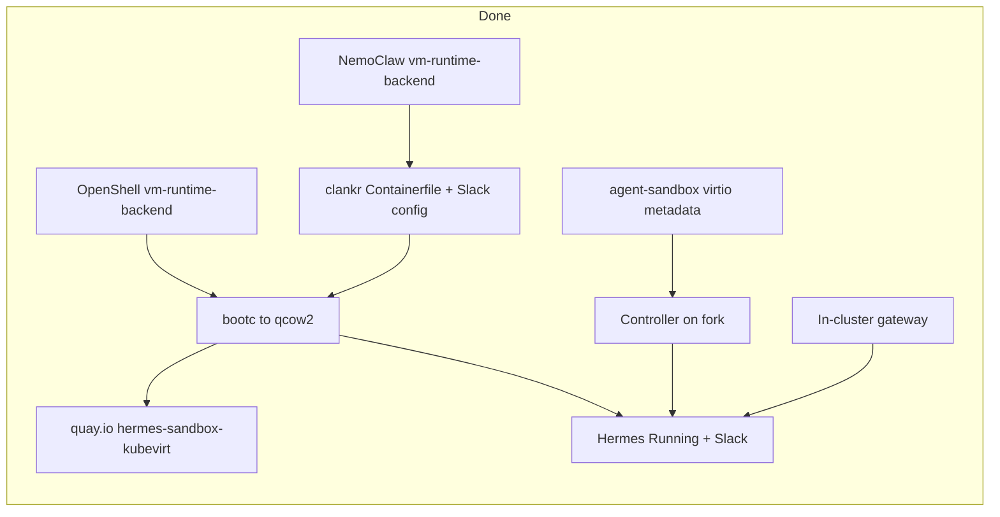

# KubeVirt VM Hermes: Handoff + Bake Results

> **Read this first if you have no context.** This is the living handoff for running Hermes (NemoClaw) as a KubeVirt VM on CRC via OpenShell’s k8s driver + agent-sandbox `runtimeBackend: VirtualMachine`. **Home of this doc:** [`shanemcd/openshell-kubevirt`](https://github.com/shanemcd/openshell-kubevirt). Last updated **2026-08-25**.

**Org move (2026-08-25):** forks + tracking repo transferred from `andyetanotherorg` → `shanemcd` (org `andyetanotherorg` is now empty). Repo links and GHCR image refs all use `shanemcd`. `REGISTRY` follows `github.repository_owner`, so new nightly builds publish to `ghcr.io/shanemcd/*`.

## Current state (2026-08-13) — CRC site sandbox Ready via GHCR (start here)

Full nightly [31687273554](https://github.com/shanemcd/openshell-kubevirt/actions/runs/31687273554) succeeded. CRC MicroShift pulls `ghcr.io/shanemcd/…` digests via [`scripts/pin-crc-from-ghcr.sh`](./scripts/pin-crc-from-ghcr.sh) (no Quay/honr mirror). Host daily gateway `openshell-ts` left alone; CRC CLI uses `OPENSHELL_GATEWAY=crc`. See [`REDEPLOY.md`](./REDEPLOY.md).

| Component | Namespace | Image | Tip |
|-----------|-----------|-------|-----|
| agent-sandbox controller | `agent-sandbox-system` | `ghcr.io/shanemcd/agent-sandbox-controller@sha256:179d60df5e542f4faa912e7ad683e16918a4f6fe6f22f37cf5c9d954e97c2e24` | `kubevirt-backend` @ `bc4bcaa` |
| OpenShell gateway STS | `openshell` | `ghcr.io/shanemcd/openshell-gateway@sha256:d29c9a8c6dc2e65756261d1b16c2b801c5e8af6c079c5e9883d07ed26b0ff01e` | `vm-runtime-backend` @ `d93a6a5` |

Created throwaway **`hermes-kv-proof`** from **`hermes-site-kubevirt`**.

| Check | Result |
|-------|--------|
| Route | Passthrough `openshell-openshell.apps.crc.testing` (not `apps-crc.testing`) |
| `openshell gateway info` (`crc`) | Healthy — gateway `0.0.83-dev.10+gd93a6a56` |
| Sandbox / VMI | **Ready** / Running (`default--hermes-kv-proof`) |
| `openshell sandbox exec whoami` | `sandbox` (combined mode) |
| Providers | **None attached** (create omitted `--provider`) |

**Blockers cleared this pass** (full recipes in [`REDEPLOY.md`](./REDEPLOY.md) §5):

1. mTLS BadSignature → re-seed client CA from same CA as regenerated server cert (Route SAN).
2. TopoLVM full → static hostpath PV/PVC `workspace-hermes-kv-proof` + `disk.img` perms `107:107` / `666` / `container_file_t`.
3. Toolbox Slack policy validation (`*.slack.com` vs `files.slack.com`) → create with patched policy.
4. SA token Secret name mismatch (`hermes-kv-proof-openshell-sa-token` vs controller `default--…-openshell-sa-token`) → sync token + VM restart; keep alias fresh on refresh.

**Open:** upstream SA-token naming fix (OpenShell vs agent-sandbox); attach providers; optional TopoLVM recovery; toolbox policy fix.

Older “honr-registry tip” / seat-internal bake sections below are **historical** — prefer GHCR digests + this section for CRC verify.

## Current state (2026-08-13) — nightly-rebuild green on `ghcr.io/shanemcd`

Proof `workflow_dispatch` of [`.github/workflows/nightly-rebuild.yml`](./.github/workflows/nightly-rebuild.yml) on `honr/card-55` completed **success** (minimal green subset: `rebase=false`, `push_images=true`, `build_container_disk=false`, `build_site_hermes=false`).

**Green run:** https://github.com/shanemcd/openshell-kubevirt/actions/runs/31667054629

**Fix that unblocked `build-nemoclaw-hermes`:** stop overriding `BASE_IMAGE` with NVIDIA `:latest` (403/missing); use the digest pin already in `shanemcd/NemoClaw` `agents/hermes/Dockerfile`.

**Jobs in scope:** meta + rebases (skip push) + `build-agent-sandbox` + `build-openshell-gateway` + `build-openshell-supervisor` + `build-nemoclaw-hermes` + `build-hermes-bootc` + `build-hermes-minimal-bootc` all **success**. Skipped (by design): containerDisk + site Hermes (multi-hour bib).

**Published image refs** (`ghcr.io/shanemcd/…`; tags from workflow):

| Image | Tags | Source tip |
|-------|------|------------|
| `agent-sandbox-controller` | `nightly`, `20260813`, `sha-a21b574` | `shanemcd/agent-sandbox` `kubevirt-backend` @ `a21b574d1f003209f49ae3c87621b6c606664a1a` |
| `openshell-gateway` | `nightly`, `20260813`, `sha-1c79e1d` | `shanemcd/OpenShell` `vm-runtime-backend` @ `1c79e1d73400821eb906267e1cc9915d25e020de` |
| `openshell-supervisor` | `nightly`, `20260813`, `sha-1c79e1d`, `kubevirt` | same OpenShell tip |
| `nemoclaw-hermes` | `nightly`, `20260813`, `sha-832c188`, `kubevirt` | `shanemcd/NemoClaw` `vm-runtime-backend` @ `832c188792a2c58be72246d1eaafae3d09eef582` |
| `hermes-sandbox-bootc` | `nightly`, `20260813`, `sha-98320d8` | this repo `images/hermes/Containerfile.nemoclaw` @ `98320d8` + tip supervisor/nemoclaw |
| `hermes-minimal-bootc` | `nightly`, `20260813`, `sha-98320d8` | this repo `images/hermes/Containerfile.minimal` @ `98320d8` + tip supervisor |

Not published this pass: `hermes-sandbox-kubevirt`, `hermes-minimal-kubevirt`, `hermes-site-*` (inputs off).

## Historical (2026-08-13) — MicroShift seat deploy + smoke (honr-registry tips)

> **Superseded.** CRC now pins GHCR nightlies directly ([`REDEPLOY.md`](./REDEPLOY.md) / section above). The honr-registry bake below is journal only.

Deployed agent-sandbox controller + OpenShell gateway (VM backend) onto the seat MicroShift cluster from **internal registry digests** only (not `ghcr.io/shanemcd`, not shanemcd GHCR). Fork `main` / upstream untouched.

**Registry pin form used on nodes:** `10.43.52.47:5000` (Service `honr-registry` ClusterIP). Node `registries.conf.d` marks that IP (+ `honr-registry.default.svc.cluster.local:5000`) insecure; short name `honr-registry.default.svc:5000` fails node DNS (`lookup … on 192.168.127.1:53: no such host`) → ImagePullBackOff. Prefer ClusterIP (or FQDN) digests for deploy.

| Component | Namespace | Image (digest) | Tip SHA | Ready |
|-----------|-----------|----------------|---------|-------|
| agent-sandbox controller | `agent-sandbox-system` | `10.43.52.47:5000/agent-sandbox-controller@sha256:82810bd8146e4472d32b0a5870c76933bf5ab935fe0f3b45931c32d46ceb76a7` | `shanemcd/agent-sandbox` `kubevirt-backend` @ `a21b574d1f003209f49ae3c87621b6c606664a1a` | **Ready 1/1** |
| OpenShell gateway STS | `openshell` | `10.43.52.47:5000/openshell-gateway@sha256:916a1351c237e145c3a8ca1ecc881c655ceaa0f475b88be38316146247dc4d53` | `shanemcd/OpenShell` `vm-runtime-backend` @ `1c79e1d73400821eb906267e1cc9915d25e020de` | **Ready 1/1** |
| OpenShell supervisor (config pin) | (gateway.toml) | `10.43.52.47:5000/openshell-supervisor@sha256:367e0962f20fe5d2157eab330300094adde7b8bc6bf8f7b5c75866a417f93825` | same OpenShell tip | pinned |
| NemoClaw / Hermes guest artifact | registry only | `…/nemoclaw-hermes@sha256:2bca6d937…` + `…/hermes-sandbox-bootc@sha256:84f95f3a4…` | NemoClaw `832c188…` / this-repo bake | **no `hermes-sandbox-kubevirt` containerDisk in registry** |

**Deploy commands (outcome OK):**

```bash
# Controller + optional KubeVirt RBAC from shanemcd/agent-sandbox@kubevirt-backend
oc apply -f k8s/crds/ -f k8s/rbac.generated.yaml \
  -f k8s/kubevirt-rbac.generated.yaml -f k8s/kubevirt.yaml
# controller.yaml with ko:// image → tip digest @ 10.43.52.47:5000
oc -n agent-sandbox-system rollout status deploy/agent-sandbox-controller  # Ready

# Gateway: helm template OpenShell chart (vm-runtime-backend) → apply;
# sandbox_namespace=default, runtime_backend=VirtualMachine, workspace_persistence=true,
# allow_unauthenticated_users=true; certgen Job; client TLS mirrored to default.
# STS data volume: emptyDir (TopoLVM had no free storage for openshell-data PVC).
# SA openshell granted SCC anyuid (chart UID 1000); ns PSA privileged.
oc -n openshell rollout status sts/openshell  # Ready
```

**Smoke:**

| Check | Result |
|-------|--------|
| Controller Ready | **Pass** — `deploy/agent-sandbox-controller` 1/1 |
| Gateway Ready | **Pass** — `sts/openshell` / `openshell-0` 1/1; config has `runtime_backend = "VirtualMachine"` |
| VM path (controller) | **Pass** — Sandbox `default/smoke-vm` (`runtimeBackend: VirtualMachine`, `quay.io/containerdisks/fedora:latest`) → Ready / VMI Running; meta Secret `smoke-vm-meta` created (then deleted) |
| Hermes create/exec | **Not feasible this pass** — registry has no `hermes-sandbox-kubevirt` (qcow2 containerDisk); tip `hermes-sandbox-bootc` is OS layers only. Attempted Sandbox with bootc digest reached VMI `Scheduling` then cleaned up. Need bib/containerDisk bake before Hermes create/exec. |
| `openshell sandbox exec` | **Skipped** — no openshell CLI on seat; Hermes guest not running |

**Seat notes / blockers hit then cleared:**

1. Short registry DNS pull failure → pinned ClusterIP (above).
2. TopoLVM PVC Pending (`node(s) did not have enough free storage`) → gateway STS uses `emptyDir` for SQLite data (smoke-adequate; not durable).
3. KubeVirt virt-api webhook certs expired (`notAfter=2026-08-11`); `virt-operator`/`hco-operator` were scaled to 0 (CSV stuck Installing) and blocked on `virt-exportproxy` Route host patch. Scaled operators to 1, deleted/recreated Route, renewed `kubevirt-ca` + `kubevirt-virt-api-certs`, rolled `virt-api` → VM create succeeded.

**Out of scope (unchanged):** full CRC live Hermes redeploy with providers/Slack; GHCR rebuilds; nightly workflow edits; merging feature branches into fork main.

## Historical (2026-08-12) — seat internal registry tip images

> **Superseded.** Prefer GHCR digests from nightly CI; pin with [`scripts/pin-crc-from-ghcr.sh`](./scripts/pin-crc-from-ghcr.sh).

Feature-branch tips were baked **in-cluster** (privileged podman Job/Pod equivalent; no seat-local podman/buildah) and pushed to **`honr-registry.default.svc:5000`** only — **no** publish to `ghcr.io/shanemcd` or shanemcd GHCR; fork `main` / upstream untouched. Prefer these digest pins over stale shanemcd nightlies on this seat.

Registry: Service `honr-registry` / DNS `honr-registry.default.svc:5000` (HTTP, insecure). No ImageStream API — use refs/digests directly.

| Image | Source tip | Tag(s) | Digest |
|-------|------------|--------|--------|
| `agent-sandbox-controller` | [`shanemcd/agent-sandbox`](https://github.com/shanemcd/agent-sandbox) `kubevirt-backend` @ `a21b574d1f003209f49ae3c87621b6c606664a1a` | `sha-a21b574`, `tip`, `kubevirt-backend` | `sha256:82810bd8146e4472d32b0a5870c76933bf5ab935fe0f3b45931c32d46ceb76a7` |
| `openshell-gateway` | [`shanemcd/OpenShell`](https://github.com/shanemcd/OpenShell) `vm-runtime-backend` @ `1c79e1d73400821eb906267e1cc9915d25e020de` | `sha-1c79e1d`, `tip`, `kubevirt` | `sha256:916a1351c237e145c3a8ca1ecc881c655ceaa0f475b88be38316146247dc4d53` |
| `openshell-supervisor` | same OpenShell tip (static `openshell-sandbox`) | `sha-1c79e1d`, `tip`, `kubevirt` | `sha256:367e0962f20fe5d2157eab330300094adde7b8bc6bf8f7b5c75866a417f93825` |
| `nemoclaw-hermes` | [`shanemcd/NemoClaw`](https://github.com/shanemcd/NemoClaw) `vm-runtime-backend` @ `832c188792a2c58be72246d1eaafae3d09eef582` | `sha-832c188`, `tip`, `kubevirt` | `sha256:2bca6d937a226f87a518a6db9370f8f354147b106acb5fd127471013193d011c` |
| `hermes-sandbox-bootc` | this repo `images/hermes/Containerfile.nemoclaw` + tip `nemoclaw-hermes` + tip `openshell-supervisor` | `tip`, `kubevirt` | `sha256:84f95f3a4f4c696921ccb8b07509110815bf65ce981bca62508cfa9193429a3a` |

Example refs:

```text
honr-registry.default.svc:5000/agent-sandbox-controller@sha256:82810bd8146e4472d32b0a5870c76933bf5ab935fe0f3b45931c32d46ceb76a7
honr-registry.default.svc:5000/openshell-gateway@sha256:916a1351c237e145c3a8ca1ecc881c655ceaa0f475b88be38316146247dc4d53
honr-registry.default.svc:5000/openshell-supervisor@sha256:367e0962f20fe5d2157eab330300094adde7b8bc6bf8f7b5c75866a417f93825
honr-registry.default.svc:5000/nemoclaw-hermes@sha256:2bca6d937a226f87a518a6db9370f8f354147b106acb5fd127471013193d011c
honr-registry.default.svc:5000/hermes-sandbox-bootc@sha256:84f95f3a4f4c696921ccb8b07509110815bf65ce981bca62508cfa9193429a3a
```

**Bake notes:** OpenShell gateway staged with `cargo zigbuild` + `bundled-z3`; supervisor musl static. NemoClaw tip image finished with ownership repairs under podman overlay (setgid inheritance differs from BuildKit). Hermes bootc Containerfile no longer `COPY`s `gosu` (absent on NemoClaw tip). **containerDisk** (`hermes-sandbox-kubevirt` qcow2 via bootc-image-builder) not produced this pass — use tip `hermes-sandbox-bootc` as the guest artifact; convert separately when bib time is budgeted.

## Current state (2026-08-12) — fork rebases onto upstream `main`

Feature branches on the `shanemcd` forks were rebased onto upstream `main` and force-pushed (fork `main` untouched; no upstream push). Tips + same-fork compare vs fork `main`:

| Fork | Branch | Tip SHA | Same-fork compare vs `main` |
|------|--------|---------|-----------------------------|
| [`shanemcd/agent-sandbox`](https://github.com/shanemcd/agent-sandbox) | `kubevirt-backend` | [`a21b574d1f003209f49ae3c87621b6c606664a1a`](https://github.com/shanemcd/agent-sandbox/commit/a21b574d1f003209f49ae3c87621b6c606664a1a) | [compare](https://github.com/shanemcd/agent-sandbox/compare/main...kubevirt-backend) |
| [`shanemcd/OpenShell`](https://github.com/shanemcd/OpenShell) | `vm-runtime-backend` | [`1c79e1d73400821eb906267e1cc9915d25e020de`](https://github.com/shanemcd/OpenShell/commit/1c79e1d73400821eb906267e1cc9915d25e020de) | [compare](https://github.com/shanemcd/OpenShell/compare/main...vm-runtime-backend) |
| [`shanemcd/NemoClaw`](https://github.com/shanemcd/NemoClaw) | `vm-runtime-backend` | [`832c188792a2c58be72246d1eaafae3d09eef582`](https://github.com/shanemcd/NemoClaw/commit/832c188792a2c58be72246d1eaafae3d09eef582) | [compare](https://github.com/shanemcd/NemoClaw/compare/main...vm-runtime-backend) |

**Verify notes (rebase Tasks):** native unit/build checks were run on each rebased branch before force-push (agent-sandbox Go/Make; OpenShell cargo/Make with `CARGO_HOME=/sandbox/.cargo`; NemoClaw repo unit/build). VM backend invariants preserved (agent-sandbox VirtualMachine path; OpenShell k8s VM path; NemoClaw Hermes guest VM-runtime). No push to upstream; fork `main` left matching upstream.

## Current state (2026-07-14) — workspace 20Gi cutover

Live Hermes uses named PVC passthrough **`workspace-hermes-20gi`** (guest `/dev/vdc` ≈ 20G). Old **`workspace-hermes`** kept as backup. agent-sandbox syncs claimName on reconcile; OpenShell supports `--workspace-pvc` / `kubernetes.workspace_pvc` for new creates. Grow procedure: [`REDEPLOY.md`](./REDEPLOY.md) §2c.

## Current state (2026-07-12 late night) — start here

### Goal of the latest work

1. **Deliver guest metadata without cloud-init** — controller attaches a KubeVirt Secret virtio disk (`serial=sandboxmeta`); Hermes bootc mounts it and owns systemd/TLS layout/supervisor start.
2. **Mirror the pod TLS contract on the VM path** — driver mounts `client_tls_secret_name` + path env vars; controller attaches Secret `volumeMount`s as extra Secret virtio disks (listed in `volumes.json`). Never pass TLS PEM via `openshell sandbox create --env`.
3. **Optional KubeVirt RBAC** — Pod-only installs must not get `kubevirt.io` in the default ClusterRole.
4. **Publish the Hermes containerDisk** to Quay for reuse outside CRC.

### Branches (compare vs upstream `main`)

| Upstream | Fork branch | Compare (upstream) | Same-fork vs `main` |
|----------|-------------|--------------------|---------------------|
| [`kubernetes-sigs/agent-sandbox`](https://github.com/kubernetes-sigs/agent-sandbox) | [`shanemcd/agent-sandbox` `kubevirt-backend`](https://github.com/shanemcd/agent-sandbox/tree/kubevirt-backend) @ `a21b574` | [upstream](https://github.com/kubernetes-sigs/agent-sandbox/compare/main...shanemcd:agent-sandbox:kubevirt-backend) | [fork](https://github.com/shanemcd/agent-sandbox/compare/main...kubevirt-backend) |
| [`NVIDIA/OpenShell`](https://github.com/NVIDIA/OpenShell) | [`shanemcd/OpenShell` `vm-runtime-backend`](https://github.com/shanemcd/OpenShell/tree/vm-runtime-backend) @ `1c79e1d` | [upstream](https://github.com/NVIDIA/OpenShell/compare/main...shanemcd:OpenShell:vm-runtime-backend) | [fork](https://github.com/shanemcd/OpenShell/compare/main...vm-runtime-backend) |
| [`NVIDIA/NemoClaw`](https://github.com/NVIDIA/NemoClaw) | [`shanemcd/NemoClaw` `vm-runtime-backend`](https://github.com/shanemcd/NemoClaw/tree/vm-runtime-backend) @ `832c188` | [upstream](https://github.com/NVIDIA/NemoClaw/compare/main...shanemcd:NemoClaw:vm-runtime-backend) | [fork](https://github.com/shanemcd/NemoClaw/compare/main...vm-runtime-backend) |
| — | [`shanemcd/clankr` `main`](https://github.com/shanemcd/clankr) (Hermes bootc image/config; no fork/upstream split) | [repo](https://github.com/shanemcd/clankr) | — |
| — | [`shanemcd/openshell-kubevirt`](https://github.com/shanemcd/openshell-kubevirt) (this handoff / tracking) | [repo](https://github.com/shanemcd/openshell-kubevirt) | — |

Local clones (paths are machine-local; remotes matter more than layout):

| Clone | Branch | Remotes |
|-------|--------|---------|
| `kubernetes-sigs/agent-sandbox` | `kubevirt-backend` → `fork/kubevirt-backend` | `origin`=sigs, `fork`=shanemcd |
| `NVIDIA/OpenShell` (local checkout often under a personal org path) | `vm-runtime-backend` → `fork/vm-runtime-backend` | `origin`=NVIDIA, `fork`=shanemcd |
| `shanemcd/NemoClaw` | `vm-runtime-backend` → `fork/vm-runtime-backend` | `upstream`=NVIDIA, `fork`=shanemcd |
| `shanemcd/clankr` | `main` → `origin/main` | `origin`=shanemcd/clankr |
| `shanemcd/openshell-kubevirt` | `main` | this tracking repo (handoff doc) |

**OpenShell note (2026-07-12):** Active fork work is thin branch [`vm-runtime-backend`](https://github.com/shanemcd/OpenShell/tree/vm-runtime-backend) (VM Sandbox spec + SA/TLS/workspace/command). Old fat branch [`kubevirt-sidecar`](https://github.com/shanemcd/OpenShell/tree/kubevirt-sidecar) is **archived** (pod sidecar topology + unrelated rebases; not needed for Hermes VM).

**agent-sandbox tip (fork):** `a21b574d1f003209f49ae3c87621b6c606664a1a` (rebased onto upstream `main`, 2026-08-12). Earlier: `e324bbf` optional KubeVirt RBAC; `99bd732` virtio Secret metadata (no cloud-init).

### Guest metadata contract (agent-sandbox → bootc)

**No `#cloud-config` / NoCloud userdata.** Controller creates Secret `<sandboxName>-meta` and attaches it as a KubeVirt Secret volume + virtio disk:

| Artifact | Contents |
|----------|----------|
| Disk serial `sandboxmeta` | Secret keys `env`, `volumes.json` (guest stages under `/run/sandbox-disks` then copies to `/etc/sandbox/` — do **not** leave `/etc/sandbox` as an iso9660 mount; SELinux blocks writes) |
| `/etc/sandbox/env` (after prepare) | Container env as `KEY=VALUE` (incl. `OPENSHELL_*` identity/endpoint/token/TLS **paths**) |
| `/etc/sandbox/volumes.json` | PVC entries `{name,serial,mountPath,source:persistentVolumeClaim,claimName}` + Secret disks `{…,source:secret,secretName}`. **Metadata disk itself is not listed.** |
| Secret `volumeMount`s (first container) | Extra Secret virtio disks (serial = sanitized volume name); guest mounts via `/dev/disk/by-id/virtio-*` and copies TLS → `/etc/openshell-tls/client` |

Bootc image ([`images/hermes/Containerfile.nemoclaw`](./images/hermes/Containerfile.nemoclaw) / [`images/hermes/Containerfile.minimal`](./images/hermes/Containerfile.minimal)) owns: `sandbox-volumes.service` (after `local-fs`, **not** `cloud-final`), `openshell-sandbox.service`, `prepare-sandbox-volumes.sh`, `openshell-sandbox-prep-env.sh`, qemu-guest-agent, supervisor binary. Cloud-init is masked in the image. Nemoclaw variant also bakes Hermes seals; minimal does not.

### What works on CRC right now

| Thing | Status |
|-------|--------|
| CRC OpenShift | Up; `oc` as `kubeadmin` via `~/.crc/machines/crc/kubeconfig` |
| Gateway `openshell-0` | **Ready 1/1** (Fedora 44 image; pin STS to **digest**, not tag alone) |
| Gateway config | `sandbox_namespace = "default"`, `runtime_backend = "VirtualMachine"`, `sandbox_command` empty or `/usr/local/bin/sandbox-entrypoint` (image owns nemoclaw-start-vm vs hermes-start.sh), `workspace_persistence = true`, `client_tls_secret_name = "openshell-client-tls"` |
| Route (prefer this) | `openshell-openshell.apps.crc.testing` → svc `openshell:grpc` (**TLS passthrough**; confirm with `oc -n openshell get route`). Older notes saying `apps-crc.testing` are stale. CLI gateway `crc` + mTLS. **Do not use `oc port-forward` for normal work.** |
| agent-sandbox controller | Virtio Secret metadata + optional kubevirt RBAC on fork. **Pin deploy image to a GHCR digest** (`./scripts/pin-crc-from-ghcr.sh`). After redeploy with the RBAC split, apply `k8s/kubevirt*.yaml` or `--kubevirt` / `KUBEVIRT=true`. |
| OpenShell k8s driver (in gateway) | VM path emits TLS Secret volume/mount + `OPENSHELL_TLS_{CA,CERT,KEY}` path env (same as pods); workspace VCT when persistence enabled |
| Hermes Sandbox / VMI | `default/hermes` Ready / Running; Slack Socket Mode recovered after guest volume prep fixes |
| Guest metadata | Virtio `sandboxmeta` + Secret disks; `/etc/sandbox/{env,volumes.json}` + `/etc/openshell-tls/client/{ca.crt,tls.crt,tls.key}` |
| Guest units | `sandbox-volumes` + `openshell-sandbox` **active**; supervisor polls `GetSandboxConfig`; Hermes gateway + Slack up |
| `openshell sandbox exec` | **Working** — e.g. `openshell sandbox exec whoami` → `sandbox` (relay/session path OK) |
| PVC `workspace-hermes` | Bound; virtio serial `workspace` |
| ContainerDisk | CRC IS `openshell-sandboxes/hermes-sandbox-kubevirt:latest` **and** Quay `quay.io/shanemcd/hermes-sandbox-kubevirt:latest` (`@sha256:59d8793f9d3641291028ce0a6a5e4b77ae1b552a0aeead5badd246a926f04f7c`, also tagged `20260711`) |
| Host CLI | **`export OPENSHELL_GATEWAY=crc`** (or [`scripts/openshell-kubevirt`](./scripts/openshell-kubevirt)) — leave host `openshell-ts` / `openshell-gateway` alone; never `OPENSHELL_GATEWAY_ENDPOINT` for CRC |

### TLS notes (do not re-litigate)

- CLI **rejects** `--env` keys starting with `OPENSHELL_` (reserved). Passing `OPENSHELL_TLS_*_B64` / PEM on create is wrong.
- Pods never got PEM via `--env` either: driver mounts the Secret and sets **path** env vars. VMs now do the same; agent-sandbox attaches the Secret as a virtio disk and the guest copies keys into place.
- Helm certgen creates `openshell-client-tls` in the **release** namespace (`openshell`). CRC has `sandbox_namespace = "default"`, so the Secret must also exist in `default` (same rule as imagePullSecrets). Prefer aligning `sandbox_namespace` to the release ns long-term; mirroring the Secret into `default` is a CRC workaround, not a create-time step.
- Guest prep still accepts legacy `SANDBOX_TLS_*_{PEM,B64}` as emergency inject only.

### Access quirks

| Method | Status |
|--------|--------|
| `openshell …` via gateway `crc` (Route) | Preferred |
| `oc port-forward … 18080:8080` | **Avoid** — leftover debug habit; Route already exists |
| Console login | `sandbox` / `sandbox` |
| Day-2 **root** SSH | KubeVirt `accessCredentials` via guest agent (not in create path): `virtctl credentials add-ssh-key --create-secret --user root --file ~/.ssh/id_rsa.pub --force hermes -n default` then `virtctl restart` (first attach only); then `virtctl ssh root@vmi/hermes -n default`. Clear stale host keys: `ssh-keygen -R 'vmi.hermes.default'`. OpenShell `connect`/`exec` stay non-root by design. |
| `openshell sandbox exec` | **Working** (`whoami` → `sandbox`); was previously flaky/empty while `GetSandboxConfig` already worked |

### Next action (highest priority)

1. Pin CRC controller + gateway from GHCR (`./scripts/pin-crc-from-ghcr.sh`) and **bind optional KubeVirt RBAC** (`kubectl apply -f k8s/kubevirt-rbac.generated.yaml -f k8s/kubevirt.yaml` or `./dev/tools/deploy-to-kube --kubevirt`).
2. Create/upgrade Hermes with `ghcr.io/shanemcd/hermes-site-kubevirt@digest` ([`REDEPLOY.md`](./REDEPLOY.md)).
3. Optionally set `sandbox_namespace = "openshell"` (or sync client TLS Secret into `default` from deploy).
4. Prove workspace PVC end-to-end on a clean recreate (no manual CR patches) — see Still open.
5. Commit remaining clankr guest image/doc changes; open upstream PRs when ready.

### Redeploy gotchas (do not repeat)

**Controller / gateway images are digest-pinned to GHCR.** `rollout restart` alone can leave the pod on an old digest. Always:

```bash
export KUBECONFIG=~/.crc/machines/crc/kubeconfig
./scripts/pin-crc-from-ghcr.sh
# or TAG=YYYYMMDD ./scripts/pin-crc-from-ghcr.sh
```

That sets both `agent-sandbox-controller` and `openshell-gateway` to `ghcr.io/shanemcd/…@sha256:…` from the `:nightly` (or date) tag.

**KubeVirt RBAC (after `e324bbf`):** core ClusterRole has **no** `kubevirt.io`. VirtualMachine sandboxes need:

```bash
# From agent-sandbox checkout
kubectl apply -f k8s/kubevirt-rbac.generated.yaml -f k8s/kubevirt.yaml
# or: KUBEVIRT=true make deploy-kind / helm --set controller.kubevirt=true / release asset kubevirt.yaml
```

**Gateway binary build (Fedora 44 toolbox):** `--features bundled-z3`, package with `FROM registry.fedoraproject.org/fedora:44` (not distroless) unless using `cargo-zigbuild`. Never put unknown TOML keys in the ConfigMap before the binary that understands them is running.

**Bootc → disk:** nightly CI runs bootc-image-builder and publishes `hermes-*-kubevirt` to GHCR. Pin create/`--from` to a GHCR digest ([`REDEPLOY.md`](./REDEPLOY.md)).

---

## Summary (history)

KubeVirt VM support for the agent-sandbox controller so Hermes (NemoClaw) runs in a VM instead of a Pod. Full gateway integration works.

**As of 2026-07-10 (evening) — BAKE COMPLETE:** Initial two-service sidecar topology verified (Slack Socket Mode + Vertex inference). Primary contact channel is **Slack**. Discord disabled in image. Signal deferred (SSRF).

**As of 2026-07-13 — DUAL SUPERVISOR MODES:** Guest supports runtime switch between **combined** (`network,process`, default) and **network** (`--mode network` + `sandbox-workload` sibling). Use `openshell-supervisor-mode {combined|network}` on the guest, or `SUPERVISOR_MODE=network` at create. See [`images/hermes/README.md`](./images/hermes/README.md).

**As of 2026-07-10 (process mode) — SINGLE SUPERVISOR:** Hermes under `openshell-sandbox` (`--mode=network,process`). No `sandbox-workload` unit.

**As of 2026-07-12 (defer privilege drop):** Tried `OPENSHELL_DEFER_PRIVILEGE_DROP=1` so NemoClaw could root-seal under the supervisor. Root+Landlock could not mint/write sandbox-owned `.env` (`ensure-api-key` EACCES) → crash loop / Provisioning.

**As of 2026-07-14 — DUAL GUEST VARIANTS:** [`images/hermes/`](./images/hermes/) builds two images from shared bootstrap scripts. **nemoclaw** (`Containerfile.nemoclaw` → `hermes-sandbox-bootc` / `hermes-sandbox-kubevirt`) keeps NemoClaw start + config seals (public nemoclaw guest). **hermes-minimal** (`Containerfile.minimal` → `hermes-minimal-bootc` / `hermes-minimal-kubevirt`) installs Hermes from the pinned NousResearch tarball and starts via `hermes-start.sh` with no MCP integrity guards. Both expose `/usr/local/bin/sandbox-entrypoint`. Nightly CI builds both bootc + containerDisk images.

**As of 2026-07-13 (match Pod privilege drop):** Guest no longer sets `OPENSHELL_DEFER_PRIVILEGE_DROP`. OpenShell chowns `/sandbox`, drops to `sandbox`, then Landlock + exec — same as Pods.

**As of 2026-07-12 (guest default command):** `openshell-sandbox-prep-env.sh` defaults `OPENSHELL_SANDBOX_COMMAND=/usr/local/bin/sandbox-entrypoint` when metadata omits it. Gateway `sandbox_command` / create `--env` still override. Prefer empty gateway `sandbox_command` so the image owns the entrypoint.

**As of 2026-07-10 (late) — BRANCHES ON FORKS:** Controller + OpenShell sidecar work pushed to `shanemcd` forks (no upstream PRs yet). Early standalone `openshell-driver-kubevirt` POC dropped from the OpenShell branch; approach is an option on the existing Kubernetes driver + process+network sidecar runtime.

**As of 2026-07-10 (cleanup) — LEAN IMAGE + NEMOCLAW BRANCH:** In-image sed/python patches removed. VM/sibling-supervisor support lives on [`shanemcd/NemoClaw` `vm-runtime-backend`](https://github.com/shanemcd/NemoClaw/tree/vm-runtime-backend) (`NEMOCLAW_VM_SIDECAR=1` / `nemoclaw-start-vm`). Bootc image is Hermes + ddgs only (no rust, build toolchain, or extra CLIs).

**As of 2026-07-10 (late) — HERMES ≥0.18 INFERENCE FIX:** `provider: anthropic` + `base_url: https://inference.local` is ignored by Hermes (`_anthropic_base_url_override_ok`); it falls back to `api.anthropic.com` (DENIED by OpenShell). Live config must use `provider: custom`, `base_url: https://inference.local`, `api_key: sk-OPENSHELL-PROXY-REWRITE`, `api_mode: anthropic_messages`. Hot-fixing config/`.env` requires regenerating hashes in **sha256sum format** via `update-config-hashes.py` (wrong format crash-loops with `Config integrity check FAILED`).

**As of 2026-07-10 (night) — CLI WAS HITTING LOCAL KUBEVIRT STACK:** `openshell sandbox create` failures (`Pending: VMI phase: Pending` → immediate Error) were **not** the agent-sandbox controller. Host CLI was talking to local Podman quadlets (`openshell-gateway` + `openshell-driver-kubevirt`) via `OPENSHELL_GATEWAY_ENDPOINT=https://tot:8080`, which create VMs/Secrets directly and skip the Sandbox CR. Fixed: register/use gateway `crc` → `https://openshell-openshell.apps-crc.testing` (mTLS, `is_remote: true`); unset the endpoint override; **mask** the local quadlets. In-cluster gateway already uses `[openshell.drivers.kubernetes]` + `runtime_backend = "VirtualMachine"`.

**As of 2026-07-10 (night) — TMPFS OVERLAY EVERY BOOT:** cloud-init `runcmd` only runs on first boot, so after reboot `/sandbox` was immutable `root:root` again → `HERMES_RESTART_SEAL_ORPHANED` / OpenShell `Provisioning`. Fix: `openshell-sandbox-prepare.service` (oneshot) runs `/etc/openshell/prepare-writable-roots.sh` before `openshell-sandbox` every boot (`Requires=` + `WantedBy=`). In `agent-sandbox` controller cloud-init; live Hermes hot-patched.

**As of 2026-07-10/11 — WORKSPACE PVC FOR VMs:** agent-sandbox maps Sandbox `volumeClaimTemplates` + first-container `volumeMounts` to KubeVirt virtio disks (`serial`, PVC `claimName: <name>-<sandbox>`). Guest prepare script waits for `/dev/disk/by-id/virtio-<serial>`, `mkfs.ext4` if empty, mounts, seeds from image using `.workspace-initialized`, skips tmpfs for PVC paths, sets `kernel.printk = 3 4 1 7`. OpenShell adds `workspace_persistence` (default `true`; env `OPENSHELL_K8S_WORKSPACE_PERSISTENCE`; Helm `server.workspacePersistence`) and emits the workspace VCT/mount for **both** Pod and VM paths when enabled.

**As of 2026-07-11 (evening) — STRIP OPENSHELL FROM CONTROLLER + VM TLS:** agent-sandbox VM path became product-neutral (initially via cloud-init `/etc/sandbox/env` + `volumes.json` + Secret projection). OpenShell k8s driver VM path mirrors pods: mount `openshell-client-tls` + `OPENSHELL_TLS_*` **paths** (never create `--env` PEMs; CLI reserves `OPENSHELL_`). Bootc owns systemd units (ordering cycle fixed: both `WantedBy=multi-user.target`). Host CLI: **Route + `OPENSHELL_GATEWAY=crc` only** (no port-forward).

**As of 2026-07-11 (night) — VIRTIO METADATA + OPTIONAL KUBEVIRT RBAC + QUAY DISK:** Replaced cloud-init userdata with Secret virtio disk `sandboxmeta` (`99bd732`). Guest prep: stage iso under `/run/sandbox-disks` (SELinux), fix `set -u` serial unbound, drop `cloud-final` deps, mask cloud-init, enable qemu-guest-agent. Day-2 root SSH via `virtctl credentials add-ssh-key` + restart. Optional ClusterRole `agent-sandbox-controller-kubevirt` (`e324bbf`; `KUBEVIRT=true` / Helm `controller.kubevirt` / release `kubevirt.yaml`). Published containerDisk to `quay.io/shanemcd/hermes-sandbox-kubevirt:latest` (`@sha256:59d8793f…`, tag `20260711`). Slack recovered after `sandbox-volumes` failures.

**As of 2026-07-12 (late night) — EXEC RELAY OK:** `openshell sandbox exec whoami` → `sandbox` via gateway `crc`. Relay/session path confirmed (no longer an open blocker). Next: redeploy controller + kubevirt RBAC; prove workspace PVC on clean recreate; Quay/ns/PR follow-ups.

## Repositories involved

| Repo | Fork / branch | Compare vs `main` | What changed |
|------|---------------|-------------------|--------------|
| `kubernetes-sigs/agent-sandbox` | [`kubevirt-backend`](https://github.com/shanemcd/agent-sandbox/tree/kubevirt-backend) @ `a21b574` | [upstream](https://github.com/kubernetes-sigs/agent-sandbox/compare/main...shanemcd:agent-sandbox:kubevirt-backend) · [fork](https://github.com/shanemcd/agent-sandbox/compare/main...kubevirt-backend) | `runtimeBackend: VirtualMachine`, virtio Secret metadata (`sandboxmeta` + Secret disks; no cloud-init), VCT→virtio PVC disks, optional kubevirt RBAC |
| `NVIDIA/OpenShell` | [`vm-runtime-backend`](https://github.com/shanemcd/OpenShell/tree/vm-runtime-backend) @ `1c79e1d` | [upstream](https://github.com/NVIDIA/OpenShell/compare/main...shanemcd:OpenShell:vm-runtime-backend) · [fork](https://github.com/shanemcd/OpenShell/compare/main...vm-runtime-backend) | Thin VM path: `runtimeBackend` / `sandboxCommand` / `workspace_persistence`, SA Secret bootstrap, VM TLS mounts. **Archived:** [`kubevirt-sidecar`](https://github.com/shanemcd/OpenShell/tree/kubevirt-sidecar) (fat pod-sidecar + rebase pile) |
| `NVIDIA/NemoClaw` | [`vm-runtime-backend`](https://github.com/shanemcd/NemoClaw/tree/vm-runtime-backend) @ `832c188` | [upstream](https://github.com/NVIDIA/NemoClaw/compare/main...shanemcd:NemoClaw:vm-runtime-backend) · [fork](https://github.com/shanemcd/NemoClaw/compare/main...vm-runtime-backend) | OpenShell-supervised identity (sibling **or parent**) + `nemoclaw-start-vm` (`NEMOCLAW_VM_SIDECAR=1`). **Archived:** [`kubevirt-sidecar`](https://github.com/shanemcd/NemoClaw/tree/kubevirt-sidecar) |
| `shanemcd/clankr` | [`main`](https://github.com/shanemcd/clankr) | — | Pod Hermes image; **bootc guest sources moved to** [`openshell-kubevirt/images/hermes`](./images/hermes/) |
| `shanemcd/openshell-kubevirt` | [`main`](https://github.com/shanemcd/openshell-kubevirt) | — | Living handoff + iteration notes for this project |

## Bake outcomes (2026-07-10 evening → 2026-07-11 night)

| Layer | Result |
|-------|--------|
| OpenShell VM driver | Thin `vm-runtime-backend` fork branch |
| agent-sandbox guest metadata | Virtio Secret disk `sandboxmeta` + Secret volumeMount disks; **no cloud-init userdata** |
| agent-sandbox RBAC | Core ClusterRole Pod-only; optional `agent-sandbox-controller-kubevirt` |
| Hermes guest entrypoint | `/usr/local/bin/sandbox-entrypoint` → `nemoclaw-start-vm` (nemoclaw) or `hermes-start.sh` (minimal) |
| clankr bootc disk | Hermes + ddgs; systemd volumes/supervisor units; Slack-only config; qemu-guest-agent |
| Published disk | CRC IS + `quay.io/shanemcd/hermes-sandbox-kubevirt:latest` |
| Live Hermes VM | Recreate via CLI (no TLS `--env`); Slack up; GetSandboxConfig OK; `sandbox exec` OK |
| Host CLI | `OPENSHELL_GATEWAY=crc` → Route (no port-forward); `openshell sandbox exec whoami` → `sandbox` |


```mermaid
flowchart LR
  subgraph done [Done]
    OS[OpenShell vm-runtime-backend]
    NC[NemoClaw vm-runtime-backend]
    AS[agent-sandbox virtio metadata]
    CF[clankr Containerfile + Slack config]
    Ctrl[Controller on fork]
    Disk[bootc to qcow2]
    Quay[quay.io hermes-sandbox-kubevirt]
    VM[Hermes Running + Slack]
    GW[In-cluster gateway]
  end
  OS --> Disk
  NC --> CF
  CF --> Disk
  Disk --> Quay
  AS --> Ctrl
  Ctrl --> VM
  Disk --> VM
  GW --> VM
```

## Architecture

### How it works in containers (the reference)

```
Pod:
  nemoclaw-start (PID 1, root)          ← container entrypoint
    └─ sets up configs, ownership
    └─ creates 'gateway' user
    └─ drops to sandbox user
    └─ runs hermes gateway

  openshell-sandbox (sidecar container)  ← separate process
    └─ creates netns + proxy
    └─ SSH relay
    └─ does NOT manage nemoclaw's process
```

Key point: the supervisor and nemoclaw-start are **peers**, not parent-child. The supervisor never touches `/sandbox` or runs `nemoclaw-start`.

### How it works in the VM (baked)

```
VM (systemd):
  (no cloud-init userdata — cloud-init masked in bootc image)

  sandbox-volumes.service          ← oneshot after local-fs; WantedBy=multi-user.target
    └─ prepare-sandbox-volumes.sh
         ├─ mount virtio sandboxmeta → stage env/volumes.json → /etc/sandbox/
         ├─ mount PVC + Secret virtio disks from volumes.json
         └─ copy TLS Secret disk → /etc/openshell-tls/client

  openshell-sandbox.service        ← After/Requires sandbox-volumes; WantedBy=multi-user.target
    └─ openshell-sandbox-prep-env.sh → /run/openshell/supervisor.env
    └─ exec /opt/openshell/bin/openshell-sandbox   (default --mode=network,process)
         Environment from drop-in (endpoint, K8S SA token path / optional JWT file, TLS paths, SANDBOX_COMMAND)
         └─ creates netns + proxy at 10.200.0.1:3128
         └─ prepare_filesystem chowns /sandbox
         └─ forks Landlock/seccomp child as root (defer drop)
              └─ nemoclaw-start-vm (NEMOCLAW_VM_SIDECAR=1) seals then setpriv-drops
                   └─ hermes gateway run
```

Earlier two-service (`--mode=network` + `sandbox-workload`) existed because combined mode dropped to sandbox before NemoClaw could seal. Defer-drop was tried so the entrypoint stayed root under Landlock; that broke `.env` mint writes. Current approach matches Pods: drop to sandbox before exec; NemoClaw uses the non-root startup path.

Controller attaches Secret virtio disks for guest metadata/TLS — **no** OpenShell units or PEM blobs in cloud-init.

### Where credentials live (important)

The OpenShell **gateway is not on the VM**. Secrets live in the gateway object store. The VM only sees placeholders; the supervisor proxy rewrites them at egress.

| Gateway | Endpoint | Role |
|---------|----------|------|
| **In-cluster** (CRC) | Cluster: `https://openshell.openshell.svc.cluster.local:8080`<br>Host CLI: `https://openshell-openshell.apps-crc.testing` (gateway name `crc`, mTLS) | Credential + inference store; kubernetes driver → Sandbox CR |
| **Local quadlets** (host) | `https://tot:8080` / `0.0.0.0:8080` | `openshell-gateway` + `openshell-driver-kubevirt` systemd units — **separate store**, creates VMs directly, **do not use** for Hermes |

These are **separate stores**. Configuring providers/inference on `tot` / local quadlets does **not** affect the VM. Always target the in-cluster gateway from the host via the **Route**:

```bash
# Preferred: registered gateway (see ~/.config/openshell/gateways/crc/)
export OPENSHELL_GATEWAY=crc
# Do NOT set OPENSHELL_GATEWAY_ENDPOINT — it overrides metadata
# Route: https://openshell-openshell.apps-crc.testing (passthrough mTLS)

openshell provider list
openshell inference get
openshell sandbox list
```

**Do not use `oc port-forward` for CRC** unless the Route is broken. Port-forward to `:18080` was a temporary debug workaround; the OpenShift Route already exposes the gateway.

**Host gateway shape (2026-08-13):** daily driver is host `openshell-ts` → local podman `openshell-gateway` (`:17670`). **Do not** stop/mask `openshell-gateway.service` — CRC Hermes verify uses the **in-cluster** STS via registered gateway `crc` (`OPENSHELL_GATEWAY=crc` or [`scripts/openshell-kubevirt`](./scripts/openshell-kubevirt)). Mask **only** the kubevirt driver so creates do not bypass the Sandbox CR:

```bash
systemctl --user stop openshell-driver-kubevirt.service 2>/dev/null || true
systemctl --user mask openshell-driver-kubevirt.service
# Keep openshell-gateway.service running for openshell-ts
```

See [`REDEPLOY.md`](./REDEPLOY.md) § *Deployment shape*.

## Root cause analysis (2026-07-10)

### Morning: proxy / entrypoint identity

| Suspected issue | Actual finding |
|-----------------|----------------|
| Proxy unreachable from netns | Proxy **was** reachable (`curl` → 400 from inside netns) |
| Stale netns from `ls -t` | Real, but not the blocker once `/run/openshell/netns` is published |
| Missing `http_proxy` | Env was already set by nemoclaw-start |
| Credential placeholders not in `.env` | **Real** — tokens are injected into **process env**, not baked into `.env`. Network-only mode never spawned a child |
| Platforms fail with 403 | **Real** — `entrypoint process not yet spawned`; identity binding needs a PID **inside the sandbox netns** |

**Fix:** OpenShell `--mode=network` publishes `/run/openshell/{netns,provider.env}`, watches `entrypoint.pid`; workload sources them, trusts MITM CA, enters netns, writes PID. (Morning used `/tmp/openshell-sandbox.new`; now baked into the image.)

### Afternoon: Slack up, inference 503

```text
HTTP 503: {'error': 'cluster inference is not configured',
           'hint': 'run: openshell cluster inference set --help'}
```

| Suspected issue | Actual finding |
|-----------------|----------------|
| Inference not set at all | Set on **`tot` only** |
| VM gateway missing routes | Supervisor fetched `route_count:0` from **in-cluster** gateway |
| Wrong Vertex project | ADC `quota_project_id` wrong; must match the Vertex project used for inference |

**Fix (in-cluster gateway via port-forward):**

```bash
oc port-forward -n openshell svc/openshell 18080:8080

openshell provider create --gateway-endpoint http://127.0.0.1:18080 \
  --name vertex-prod --type google-vertex-ai --from-gcloud-adc \
  --config VERTEX_AI_PROJECT_ID=<YOUR_VERTEX_PROJECT_ID> \
  --config VERTEX_AI_REGION=global

openshell inference set --gateway-endpoint http://127.0.0.1:18080 \
  --provider vertex-prod --model claude-opus-4-6
```

### Evening bake lessons

1. **entrypoint.pid `$$`**: use wrapper under `/etc/openshell/` (bootc `/usr` is read-only; systemd `$` escaping is fragile)
2. **`/sandbox` root:root after tmpfs**: NemoClaw treats this as an orphaned seal — re-`chown root:sandbox` + `chmod 1775`
3. **bootc UID remap**: normalize `.hermes` mutable trees to `sandbox:sandbox`, re-lock trust anchors (`config.yaml`, `.config-hash`, `SOUL.md`)
4. **gateway ∈ sandbox group** required to read `.env` / locks (`usermod -aG sandbox gateway`)
5. **first-boot Slack race**: source `provider.env` in the wrapper; don't rely only on systemd `EnvironmentFile` timing

### Operational footgun: NemoClaw config hashes

On the **nemoclaw** guest, editing `/sandbox/.hermes/config.yaml` or MCP servers without resealing `.config-hash` crash-loops the workload. On **hermes-minimal**, config is mutable (no integrity seals); MCP OAuth state lives under `/sandbox/.hermes/mcp-tokens/` on the PVC.

### Operational footgun: kube API from Hermes (OpenShell SSRF)

OpenShell **denies sandbox egress to port 6443** (control-plane SSRF). Do not point `oc` at `api.crc.testing:6443` or expect `kubernetes.default.svc:443` to work from inside the sandbox netns. The old in-cluster `hermes-kube-proxy` + `hermes-admin` SA has been removed.

### Operational footgun: Hermes ≥0.18 + OpenShell inference

Do **not** set `model.provider: anthropic` with `base_url: https://inference.local`. Hermes drops the override and calls `api.anthropic.com`, which OpenShell denies → Slack “model provider failed after retries”. Use `provider: custom` + `api_mode: anthropic_messages` + literal `sk-OPENSHELL-PROXY-REWRITE` (see `hermes-config.py` / `hermes.env`).

Also clear `providers` / `custom_providers` entries named `custom`. A leftover block (e.g. Nemotron + `chat_completions`) hijacks `resolve_runtime_provider()` and ignores `model.api_mode`, producing `POST /v1/chat/completions` / `/api/show` instead of `/v1/messages` → `no compatible inference route available`.

### Night: create failed with `Pending: VMI phase: Pending`

| Suspected issue | Actual finding |
|-----------------|----------------|
| Controller marks Ready reason=`Pending` as terminal | Controller correctly uses `DependenciesNotReady` + `VMI phase: …` |
| In-cluster gateway broken | In-cluster was fine (`openshell_driver_kubernetes`); **no CreateSandbox** in its logs |
| Wrong image / disk | Secondary — community `base` is not a containerdisk (`…/merged/disk: no such file`) |
| CLI → wrong gateway | **Real** — `OPENSHELL_GATEWAY_ENDPOINT=https://tot:8080` + local kubevirt driver; Ready condition used `reason: phase` (`Pending`) → gateway treated as terminal Error |

**Fix:** point CLI at `crc` (route + mTLS), mask local quadlets, create with Hermes containerdisk (`hermes-sandbox-kubevirt:latest`), not `ghcr.io/nvidia/openshell-community/sandboxes/base:latest`.

## Current live outcomes

| Platform / path | Status | Notes |
|-----------------|--------|-------|
| Host CLI → in-cluster gateway | **Working** | `OPENSHELL_GATEWAY=crc`; local quadlets masked; creates → Sandbox CR; `sandbox exec` OK |
| Gateway pod | **Ready** | Fedora 44 image + bundled-z3; digest-pinned STS |
| Workspace PVC path | **Partial** | Live Hermes has PVC + virtio disk (manual patch provenance); driver auto-inject **unverified** |
| Slack | **Was working** | Socket Mode through proxy; re-verify after clean Hermes recreate |
| Inference (`inference.local`) | **Was working** | `provider: custom` + `api_mode: anthropic_messages`; in-cluster `vertex-prod` → Claude Opus |
| Discord | **Disabled** in image | Token rotation is separate if re-enabled |
| Signal | **Working** (CRC) | In-cluster signal-cli; see [`signal/`](./signal/) |
| Kube API (`oc`) | **Removed** | `hermes-kube-proxy` + `hermes-admin` deleted; direct `:6443` still SSRF-blocked |
| Atlassian MCP | ALLOWED | Proxy allows |
| GitHub | ALLOWED | CDN hosts + github provider; install tools under `/sandbox/.hermes/bin` |

## Still open

#### VM sandbox JWT rebootstrap after reboot

**Fixed in forks (local, not yet redeployed on CRC):**

- OpenShell `vm-runtime-backend`: VM Sandbox CR uses `OPENSHELL_K8S_SA_TOKEN_FILE` + Secret volume `{name}-openshell-sa-token` (no static `OPENSHELL_SANDBOX_TOKEN`)
- agent-sandbox `kubevirt-backend`: companion Pod `{name}-openshell-bootstrap` + rotating BoundObjectRef TokenRequest → that Secret
- Hermes guest: `openshell-sandbox-prep-env.sh` prefers SA token path over static JWT file

Redeploy controller + gateway, recreate Hermes (or wait for nightly), then reboot VM and confirm supervisor does not crash-loop on `ExpiredSignature`.

#### Prove workspace PVC end-to-end (next)

Hermes already has a Bound `workspace-hermes` PVC and a virtio `workspace` disk, but the CR was **manually patched**. Recreate without patches:

```bash
export OPENSHELL_GATEWAY=crc
unset OPENSHELL_GATEWAY_ENDPOINT
# destroy existing sandbox via openshell CLI (or oc delete sandbox/vm/vmi/pvc as needed)
openshell sandbox create …   # same Hermes image / name as before; pass --provider for github/slack/vertex-prod/atlassian
for p in github slack vertex-prod atlassian; do openshell sandbox provider attach hermes "$p"; done
oc -n default get sandbox hermes -o yaml | rg -A20 'volumeClaimTemplates|volumeMounts|runtimeBackend'
oc -n default get pvc workspace-hermes
virtctl ssh sandbox@vmi/hermes -n default --local-ssh-opts='-oStrictHostKeyChecking=no' \
  --command='findmnt /sandbox; cat /proc/mounts | grep sandbox'
```

Expect: driver-emitted VCT; PVC Bound; `/sandbox` on `/dev/vdc` (or similar) ext4 with `.workspace-initialized`; survives reboot without seal orphan errors.

#### Signal on VMs

**Done on CRC** via in-cluster signal-cli — see [`signal/`](./signal/). `host.containers.internal` remains blocked by OpenShell SSRF; do not use it.

#### Kube API (`oc`) from Hermes

**Removed:** in-cluster kubectl proxy (`hermes-kube-proxy` / `hermes-admin`). Direct `:6443` remains blocked by OpenShell SSRF.

#### Discord token (low priority)

Not a VM wiring bug. Image disables Discord. Rotate `DISCORD_BOT_TOKEN` on the **in-cluster** gateway only if Discord is re-enabled.

#### Commits / PRs

| Repo | Status |
|------|--------|
| agent-sandbox | Fork branch [`kubevirt-backend`](https://github.com/shanemcd/agent-sandbox/tree/kubevirt-backend) @ [`a21b574`](https://github.com/shanemcd/agent-sandbox/commit/a21b574d1f003209f49ae3c87621b6c606664a1a) includes VM backend + VCT→virtio. [Upstream compare](https://github.com/kubernetes-sigs/agent-sandbox/compare/main...shanemcd:agent-sandbox:kubevirt-backend) · [same-fork vs main](https://github.com/shanemcd/agent-sandbox/compare/main...kubevirt-backend). **No upstream PR yet.** |
| OpenShell | Fork branch [`vm-runtime-backend`](https://github.com/shanemcd/OpenShell/tree/vm-runtime-backend) @ [`1c79e1d`](https://github.com/shanemcd/OpenShell/commit/1c79e1d73400821eb906267e1cc9915d25e020de) is the thin VM path. [Upstream compare](https://github.com/NVIDIA/OpenShell/compare/main...shanemcd:OpenShell:vm-runtime-backend) · [same-fork vs main](https://github.com/shanemcd/OpenShell/compare/main...vm-runtime-backend). **No upstream PR yet.** [`kubevirt-sidecar`](https://github.com/shanemcd/OpenShell/tree/kubevirt-sidecar) archived. Discard `kubevirt-driver` (standalone POC). |
| NemoClaw | Fork branch [`vm-runtime-backend`](https://github.com/shanemcd/NemoClaw/tree/vm-runtime-backend) @ [`832c188`](https://github.com/shanemcd/NemoClaw/commit/832c188792a2c58be72246d1eaafae3d09eef582). [Upstream compare](https://github.com/NVIDIA/NemoClaw/compare/main...shanemcd:NemoClaw:vm-runtime-backend) · [same-fork vs main](https://github.com/shanemcd/NemoClaw/compare/main...vm-runtime-backend). **No upstream PR yet.** [`kubevirt-sidecar`](https://github.com/shanemcd/NemoClaw/tree/kubevirt-sidecar) archived. |
| clankr | [`shanemcd/clankr` `main`](https://github.com/shanemcd/clankr) — lean image/config/docs. |

Local clones: OpenShell remotes should be `origin=NVIDIA/OpenShell`, `fork=shanemcd/OpenShell`. NemoClaw: `upstream=NVIDIA/NemoClaw`, `fork=shanemcd/NemoClaw`. agent-sandbox: `origin=kubernetes-sigs/agent-sandbox`, `fork=shanemcd/agent-sandbox`.

## Workspace PVC design (2026-07-10/11)

```
OpenShell k8s driver (workspace_persistence=true)
  → Sandbox CR:
       runtimeBackend: VirtualMachine
       volumeClaimTemplates: [{ name: workspace, 10Gi, RWO }]
       containers[0].volumeMounts: [{ name: workspace, mountPath: /sandbox }]

agent-sandbox controller
  → reconcilePVCs → PVC workspace-<sandboxName>
  → KubeVirt VM disks/volumes: virtio disk serial=<alphanumeric name>, claimName=workspace-<sandbox>
  → cloud-init prepare-writable-roots.sh every boot:
       wait /dev/disk/by-id/virtio-<serial>
       mkfs.ext4 if blank → mount → seed from image if no .workspace-initialized
       skip tmpfs overlay for PVC mount paths
```

Key code:

- agent-sandbox: `collectVMVolumeMounts`, `appendVMClaimDisks`, `virtioDiskSerial`, `buildPrepareWritableRootsScript` in `controllers/sandbox_controller.go`
- OpenShell: `workspace_persistence` on k8s driver config; `sandbox_to_k8s_spec_vm` + Pod `apply_workspace_persistence` gated on the same flag; unit tests `workspace_*` in `driver.rs`

OpenShell CLI: `--workspace-pvc <claim>` (and `{"kubernetes":{"workspace_pvc":"…"}}`) omits VCT and attaches an existing claim at `/sandbox`. agent-sandbox prefers that explicit claimName over VCT and syncs it onto live VMs (`syncVMPersistentVolumeClaims`). See [`REDEPLOY.md`](./REDEPLOY.md) §2c.

## Code changes

### `NVIDIA/OpenShell` → fork branch `vm-runtime-backend`

Thin PR on current NVIDIA `main` (~11 files / ~550 LOC). **No** pod sidecar topology.

**`openshell-driver-kubernetes`:** `runtime_backend` / `sandbox_command` / `workspace_persistence`; `sandbox_to_k8s_spec_vm()` emits VirtualMachine Sandbox CRs with SA Secret `{name}-openshell-sa-token`, client TLS mounts, workspace VCT, and `OPENSHELL_SANDBOX_COMMAND`.


Helm `gateway-config` keys: `runtimeBackend`, `sandboxCommand`, `workspacePersistence`.

> **Archived:** fork branch [`kubevirt-sidecar`](https://github.com/shanemcd/OpenShell/tree/kubevirt-sidecar) carried pod sidecar topology + unrelated upstream rebases; do not use for Hermes VM. Early standalone `openshell-driver-kubevirt` POC on `kubevirt-driver` remains discarded.

### `kubernetes-sigs/agent-sandbox` → fork branch `kubevirt-backend`

**API:** `runtimeBackend` on `SandboxBlueprint` (`Pod` \| `VirtualMachine`).

**VM backend (current tip):**
- Guest metadata Secret `<sandbox>-meta` → virtio serial `sandboxmeta` (keys `env`, `volumes.json`) — **not** cloud-init
- PodTemplate Secret `volumeMount`s → additional Secret virtio disks + `volumes.json` entries
- VCT → virtio PVC disks; Ready while VMI pending uses `DependenciesNotReady` + `VMI phase: …`
- Optional RBAC: `controllers/kubevirt` → ClusterRole `agent-sandbox-controller-kubevirt` (`KUBEVIRT=true` / Helm `controller.kubevirt` / `kubevirt.yaml`)

Older process-mode cloud-init snippets in this doc are **historical** (Hermes bootc owns units now).

CRDs regenerated with `make fix-go-generate` (conversion webhook via `sort-crd-versions`).

### `NVIDIA/NemoClaw` → fork branch `vm-runtime-backend`

**`agents/hermes/runtime-config-guard.py`:** when `NEMOCLAW_VM_SIDECAR=1`, accept sibling `openshell-sandbox` identity and skip PID-1 readiness proofs.

**`agents/hermes/validate-env-secret-boundary.py`:** same gate for env-file / runtime-env checks.

**`agents/hermes/start.sh` + `start-vm.sh`:** skip Landlock-hostile `tee` redirects; put `/opt/hermes/.venv/bin` on PATH; when already non-root (OpenShell dropped privileges — Pod path and current VM path), force `NEMOCLAW_CAPS_DROPPED` and skip the root seal path. Wrapper installs as `/usr/local/bin/nemoclaw-start-vm`.

### `shanemcd/clankr` (`main`)

**[`images/hermes/Containerfile.nemoclaw`](./images/hermes/Containerfile.nemoclaw):** `COPY --from` NemoClaw Hermes + OpenShell supervisor; Hermes seals / MCP integrity; messaging platforms per baked config. **[`images/hermes/Containerfile.minimal`](./images/hermes/Containerfile.minimal):** installs Hermes from pinned NousResearch tarball; no NemoClaw. Both: cloud-init masked; qemu-guest-agent enabled; `PermitRootLogin prohibit-password`.
**Guest bootstrap (image-owned):** `sandbox-volumes.service` + `openshell-sandbox.service` consume virtio `sandboxmeta` + Secret/PVC disks (`prepare-sandbox-volumes.sh`). Stage iso under `/run/sandbox-disks` before copying to `/etc/sandbox` (SELinux). The controller does not write OpenShell systemd units or prepare scripts.
**Config bake:** `hermes-config.py`, `hermes.env.example`, `SOUL.md` (agent-sandbox / OpenShell inference only).

## CRC deployment state

| Component | Namespace | Image | Notes |
|-----------|-----------|-------|-------|
| Agent-sandbox controller | `agent-sandbox-system` | `ghcr.io/shanemcd/agent-sandbox-controller@sha256:179d60df…` | Pinned from nightly (`sha-bc4bcaa`); bind kubevirt RBAC if missing |
| OpenShell gateway | `openshell` | `ghcr.io/shanemcd/openshell-gateway@sha256:d29c9a8c…` | Distroless nightly (`sha-d93a6a5`); `workspace_persistence = true` |
| Host CLI gateway | (registration `crc`) | Route (passthrough) | mTLS; `OPENSHELL_GATEWAY=crc` — recreate Route if missing |
| Local quadlets | (host systemd) | `openshell-gateway` (daily `openshell-ts`) + optional kubevirt driver | Keep **gateway**; mask **driver only** for CRC Hermes (see REDEPLOY) |
| Live supervisor binary | (on VM) | `/opt/openshell/bin/openshell-sandbox` | Baked into guest bootc |
| Hermes containerDisk | (create `--from`) | `ghcr.io/shanemcd/hermes-site-kubevirt:nightly` | Preferred CRC site guest |
| Hermes VMI | `default` | (none until create) | See [`REDEPLOY.md`](./REDEPLOY.md) §2-create |
| Workspace PVC | `default` | `workspace-hermes` | Bound when Sandbox exists |

**In-cluster gateway config (effective):** TLS + client CA mounted; `allow_unauthenticated_users = true`; `[openshell.drivers.kubernetes]` with `runtime_backend = "VirtualMachine"`, `sandbox_command` empty or `/usr/local/bin/sandbox-entrypoint`, `workspace_persistence = true`, `sandbox_namespace = "default"`. Route termination: **passthrough**.

**Helm-shaped values (reference):**
```
server.auth.allowUnauthenticatedUsers=true
server.sandboxNamespace=default
server.logLevel=debug
server.runtimeBackend=VirtualMachine
server.sandboxCommand=/usr/local/bin/sandbox-entrypoint
server.workspacePersistence=true
# TLS enabled in-cluster (passthrough Route); do not assume disableTls=true
```

**In-cluster providers:** github, atlassian, slack, **vertex-prod** (discord may still exist in store but image disables the platform). Inference: `vertex-prod` / `claude-opus-4-6`.

**After every Hermes recreate:** attach all four (`github`, `slack`, `vertex-prod`, `atlassian`). Provider links are per-sandbox and do not survive delete. Vertex can answer via inference without an attach — still attach. See [`REDEPLOY.md`](./REDEPLOY.md) §3.

### Rebuild / redeploy gateway + controller

Prefer the nightly GHCR images — do not push into a CRC/OpenShift registry for day-2 pins:

```bash
export KUBECONFIG=~/.crc/machines/crc/kubeconfig
./scripts/pin-crc-from-ghcr.sh
```

For a one-off local gateway binary experiment, build on the host/toolbox and run it outside CRC; CRC verify stays on `ghcr.io/shanemcd/openshell-gateway@…`.

### Rebuild / redeploy agent-sandbox controller

Same pin script as above (`agent-sandbox-controller` from `kubevirt-backend`). After Go changes on the fork, wait for nightly (or a `workflow_dispatch` with `push_images=true`) then re-run `./scripts/pin-crc-from-ghcr.sh`.

## Sidecar coordination contract

```
/run/openshell/netns            # absolute path, e.g. /run/netns/sandbox-abcd1234
/run/openshell/provider.env     # KEY=openshell:resolve:env:vNNN_KEY (mode 0644)
/run/openshell/entrypoint.pid   # child PID in sandbox netns (process mode)
/etc/openshell-tls/ca-bundle.pem
/etc/openshell-tls/openshell-ca.pem
```

Process mode injects provider placeholders + proxy/TLS env into the child.

## Debugging tips

```bash
# VM
virtctl ssh sandbox@vmi/hermes -n default --local-ssh-opts="-oStrictHostKeyChecking=no" --command='...'
sudo systemctl status openshell-sandbox
# Expect: no sandbox-workload unit
sudo cat /run/openshell/netns /run/openshell/entrypoint.pid
sudo cut -d= -f1 /run/openshell/provider.env
findmnt /sandbox; ls -la /dev/disk/by-id/virtio-workspace
sudo journalctl -u openshell-sandbox.service --no-pager -n 80 \
  | grep -E 'Preserving sandbox ownership|Published sidecar|DENIED|ALLOWED|route_count|Inference|Landlock|slack|✓'
sudo journalctl -u openshell-sandbox-prepare.service --no-pager -n 40

# In-cluster gateway (not tot / not local quadlets!)
export OPENSHELL_GATEWAY=crc
unset OPENSHELL_GATEWAY_ENDPOINT
openshell gateway info          # expect openshell-openshell.apps-crc.testing
openshell inference get
openshell provider list
# Confirm creates hit k8s driver: oc logs -n openshell openshell-0 | grep 'Creating sandbox in Kubernetes'

# Inference probe from sandbox netns (via proxy)
sudo nsenter --net=$(cat /run/openshell/netns) env \
  http_proxy=http://10.200.0.1:3128 https_proxy=http://10.200.0.1:3128 \
  SSL_CERT_FILE=/etc/openshell-tls/ca-bundle.pem \
  curl -sS https://inference.local/v1/messages ...
```

## Key design decisions

| Decision | Rationale |
|----------|-----------|
| Single supervisor (`network,process`) | Landlock/seccomp apply to Hermes; netns + proxy stay in the same binary |
| provider.env / process env (not .env mutation) | Mutating `.env` breaks NemoClaw config hashes |
| Guard via `NEMOCLAW_VM_SIDECAR` | Supervisor may be sibling or parent; stock container proofs stay unchanged |
| bootc + bootc-image-builder | Fast layer-cached builds; Fedora 44 base; NoCloud datasource added manually |
| Configure inference on in-cluster gateway | VM supervisor never talks to host-local `tot`; separate credential stores |
| Host CLI → gateway `crc` (route + mTLS) | `OPENSHELL_GATEWAY_ENDPOINT` / local kubevirt quadlets bypass Sandbox CR and poison debugging |
| Mask local OpenShell quadlets during CRC work | Units auto-start via `WantedBy=default.target` and bind `:8080` |
| PVC for `/sandbox` (not only tmpfs) | Tmpfs is per-boot ephemeral; workspace needs durable agent state |
| Virtio serial = sanitized volume name | KubeVirt disk serial ≤20 alphanumeric; guest finds `/dev/disk/by-id/virtio-<serial>` |
| `workspace_persistence` default true | Match Pod behavior; disable via config/env/Helm when ephemeral is desired |
| Fedora 44 gateway image for local CRC builds | Native toolbox binaries need matching libstdc++; upstream path remains zigbuild→distroless |
